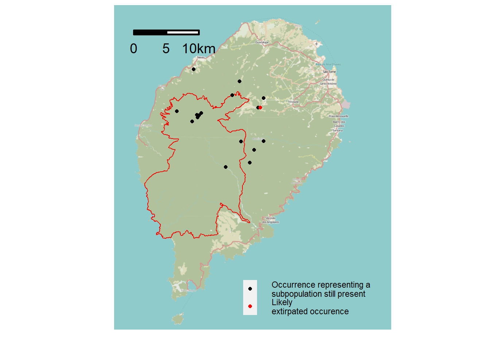

# Checklist {#sp-list}


## *Brachystephanus occidentalis*

[*Brachystephanus occidentalis*](https://tropicos.org/name/100299918)


```
#> png 
#>   2
#> [1] TRUE
```





<iframe src="https://cepf-stp-threat-flora.netlify.app/img/leaflet" width="672" height="400px"></iframe>


<iframe src="http://legacy.tropicos.org/ImageFullView.aspx?imageid=100793776" width="672" height="400px"></iframe>


```r


sampling_records_grid_A <- 
  ggplot() +
  geom_sf(
    data = A,
    fill = "lightgrey",
    color = "black",
    lwd = NA
  ) +
  ggspatial::annotation_map_tile(zoom = 13, cachedir = system.file("rosm.cache", package = "ggspatial")) +
  geom_sf(data = protected_areas,
          fill = NA,
          color = "red",
          lwd = 1) +
  ggtitle(label = "a)") +
  labs(y= " ", x = " ") +
  geom_sf(data = grid_completed_A %>% 
            filter(!is.na(n)), mapping = aes(fill = n)) +
  scale_fill_viridis_c(name = "Number of \nrecords", direction = -1, alpha = 0.5, option = "plasma") +
  scale_x_continuous(limits = c(5.61, 5.68)) +
  scale_y_continuous(limits = c(-1.49, -1.4)) +
  theme(panel.background = element_rect(fill = "white", colour = NA),
        legend.background = element_rect(fill = NA, colour = NA),
        legend.text = element_text(size = 10),
        legend.title = element_text(size = 12, face = "bold"),
        legend.key.size = unit(1,"line"),
        legend.position = c(0.8, 0.2),
        axis.text = element_blank(),
        axis.ticks = element_blank()) +
    ggsn::scalebar(dist = 1, dist_unit = "km",
                   transform = TRUE, model = "WGS84", 
                   x.min = 5.61, x.max = 5.63, y.min = -1.481, y.max = -1.44, 
                 st.dist = 0.1)

```


