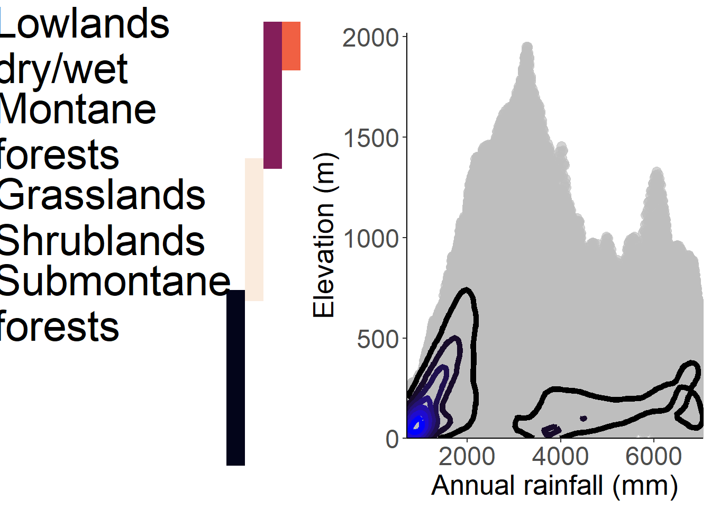

# Materials and methods

## Database

## Assessments

## Species ecology

(\#fig:unnamed-chunk-1-1)Insight into the main climatic patterns of Sao Tomé by relating the two most contrasted environmental factors of the island: altitude and annual rainfall. The lines of the plot show the frequency of combined environmental conditions. The colored band on the left show the described vegetation belts along elevation.

(\#fig:unnamed-chunk-1-2)Insight into the main climatic patterns of Sao Tomé by relating the two most contrasted environmental factors of the island: altitude and annual rainfall. The lines of the plot show the frequency of combined environmental conditions. The colored band on the left show the described vegetation belts along elevation.

(\#fig:EcoPrincipe-1)Insight into the main climatic patterns of Principe by relating the two most contrasted environmental factors of the island: altitude and annual rainfall. The lines of the plot show the frequency of combined environmental conditions. The colored band on the left indicate approximate vegetation belts along elevation.

(\#fig:EcoPrincipe-2)Insight into the main climatic patterns of Principe by relating the two most contrasted environmental factors of the island: altitude and annual rainfall. The lines of the plot show the frequency of combined environmental conditions. The colored band on the left indicate approximate vegetation belts along elevation.

