# Checklist {#sp-list}

## Pteridophytes

### ``Aspleniaceae``

#### ``Asplenium eurysorum Hieron.``

#### Status {.unnumbered}

#### Rationale {.unnumbered}

*Asplenium eurysorum* is an epiphyte fern. The species is known from Gabon and the islands of São Tomé and Príncipe. It occurs frequently within dense, tall, very wet forests with submontane affinity on rock faces in *terra firme* forest on ridge, between 160 and 1,987 m in elevation. It was previously assessed as VU D2 by Figueiredo and Gascoigne (2001), as the population was present in two locations, São Tomé and Príncipe (D2). This assessment was never published on the Red List and the fact it has been conducted 20 years ago as well as the availability of distribution data justify its reassessment.
*Asplenium eurysorum* is known from 31 collections made between 1853 (Welwitsch 14, Watt 14) and 2018 (Bidault 3983). One collection (Barter 1896) does not have precise coordinates and was not taken into account for estimating the assessment parameters. The 30 remaining collections represent 19 occurrences. In São Tomé, there are fifteen occurrences, eight of which are located within the PNOST, one outside PNOST to the southeast, and the six others to the northeast outside PNOST. However, the occurrence of São Pedro-Lagoa Amélia (Monod 11714) is considered extirpated and therefore was not taken into account for this assessment. In Príncipe, there are three occurrences, two inside the PNOP and one outside. The occurrence in Gabon is located within the Ramsar site of Birougou. The 18 remaining occurrences represent 3 subpopulations (the seeds of the species are mainly dispersed by wind). Based on a 2 x 2 km cell size, the AOO is estimated as 64 km², below the upper threshold of the EN status under subcriterion B2. The EOO is calculated as 65,392 km², above the upper threshold of the “Vulnerable” status under subcriterion B1. The two occurrences south of PNOST (Oliveira 424, Espirito Santo 5139) are threatened by old cocoa plantations and represent one location. The occurrence that is southeast of São Tomé (Oliveira 1419) is threatened by small-scale agriculture and represents one location. The two occurrences between Zampalma and Calvario (Oliveira 1461, Espirito Santo 5070) are threatened by small-scale agriculture and illegal logging and represent one location. The occurrence of Macambrara (Exell 132) is threatened by vegetable agriculture and represents one location. We infer a future disappearance of this occurrence. All occurrences that are in the touristic path in the PNOST (Gascoigne 10, Oliveira 1212, Paiva 883, Sousa 1267, Stévart 1267, Moller 28, Lejoly 1, Matos 7382) are threatened by ecotourism and invasive plants and represent one location. The occurrence in the north on the periphery of the PNOST (Paiva 467) is threatened by small-scale agriculture and illegal logging and represents one location. The occurrence between São Joaquim and São Carlos de Fundão (Gascoigne 35) in the PNOP is not threatened and represents one location. The occurrences at Pico Papagaio (Watt 24, Welwitsch 14, Paiva 595) are indirectly threatened by ecotourism and represent one location. The third occurrence of Príncipe at Ôquê Nazaré (Newton 27) is threatened by old cocoa plantations and quarries and represents one location. The occurrence of Gabon (Bidault 3983) is not threatened and represents one location. Therefore, these 18 occurrences represent 10 locations (sensu IUCN, 2019), with regards to the most important threat (small-scale agriculture). We infer a continuing decline in the extent and quality of its habitat. We also infer a continuing decline in its AOO, the number of mature individuals, and the number of subpopulations based on inferred future disappearance of one occurrence situated at Macambrara. Therefore, *Asplenium eurysorum* is assessed as VU B2ab(ii,iii,iv,v).

#### Habitat and ecology {.unnumbered}

The species occurs frequently in dense, tall, very wet lowland and submontane forests, on rocky habitat, in *terra firme* forest, on ridges, between 160 and 1,987 m in elevation.

#### Use and trade {.unnumbered}
There are no known uses of this species.

#### Population {.unnumbered}
The species has been collected more in São Tomé than in Príncipe and Gabon where it is under-collected. Its current distribution represents 3 subpopulations.

<iframe src="https://cepf-stp-threat-flora.netlify.app/img/leaflet_Asplenium_eurysorum.html" width="672" height="400px"></iframe>

(\#fig:unnamed-chunk-10)An interactive distribution map.

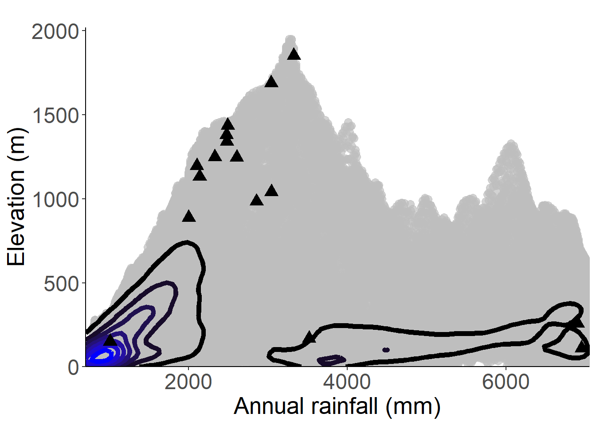

(\#fig:unnamed-chunk-12)Occurrences of Asplenium eurysorum in the climate conditions of São Tomé.

(\#fig:unnamed-chunk-13)Occurrences of Asplenium eurysorum in the climate conditions of Príncipe.

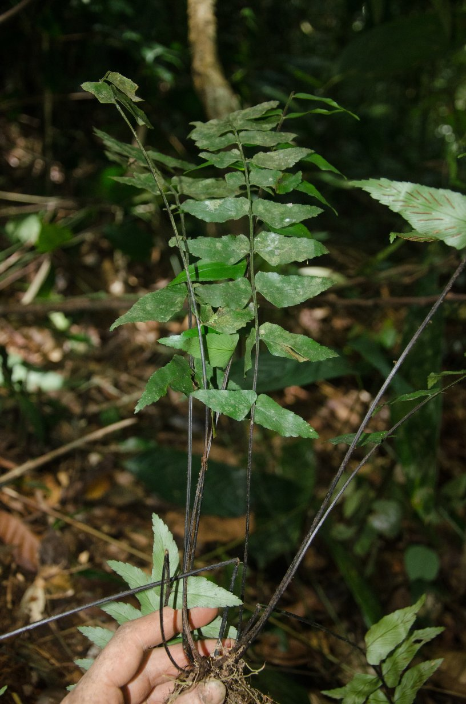

(\#fig:unnamed-chunk-16-1)Copyright Bidault

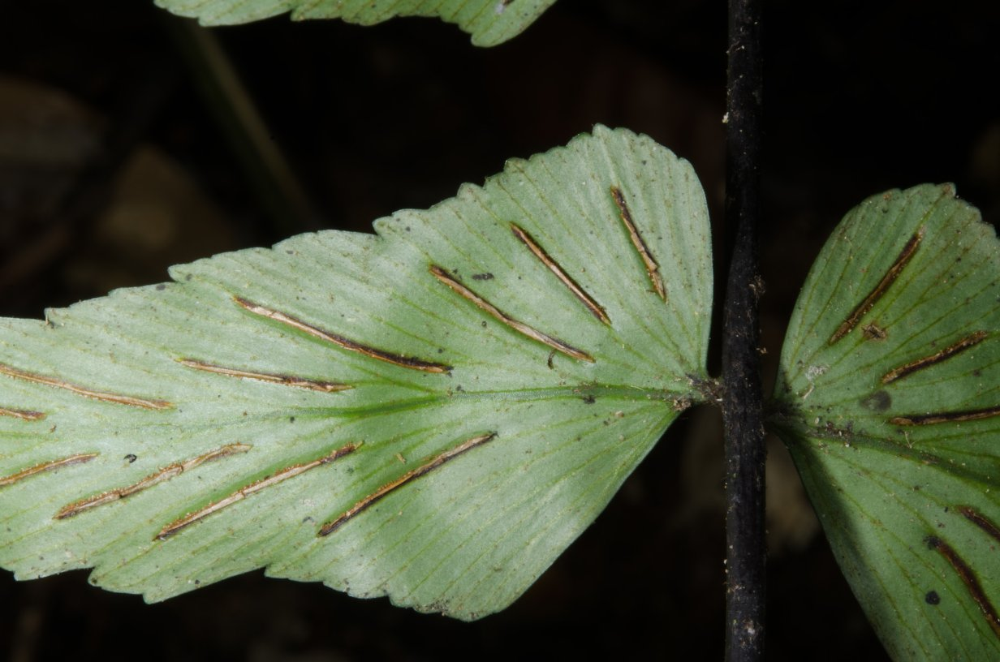

(\#fig:unnamed-chunk-16-2)Copyright Bidault

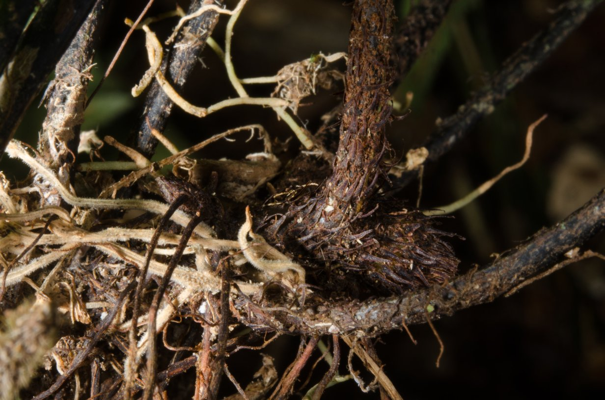

(\#fig:unnamed-chunk-16-3)Copyright Bidault

#### ``Asplenium exhaustum (H. Christ) Alston``

#### Status {.unnumbered}

#### Rationale {.unnumbered}

*Asplenium exhaustum* is an epiphytic fern, most often found in old plantations as well as in secondary forests, between 110 and 1,120 m in elevation. It is an endemic species of São Tomé. A preliminary evaluation was already made by Figueiredo and Gascoigne in 2001, who evaluated it as EN. The species is known from 13 collections made between 1905 (Chevalier 14587) and 2008 (Oliveira 1348, 1432). Five of these collections do not have precise coordinates and were not taken into account for estimating the assessment parameters. The seven remaining collections represent 6 occurrences and 1 subpopulation (the seeds of the species are mainly dispersed by wind). Based on a 2 x 2 km cell size, the AOO is estimated as 24 km², below the upper threshold of the EN status under subcriterion B2. The EOO is calculated as 146.357 km², below the upper threshold of the EN status under subcriterion B1. The occurrence (Oliveira 1348) in the south of the PNOST is not threatened and represents one location. The occurrence that is located between Valcarmo and Roça S. João (Oliveira 1432) is threatened by small-scale agriculture and oil palm plantations and represents one location. We infer a future disappearance of this occurrence due to the oil palm plantation project in this locality. The Roça Cruzeiro occurrence (Thorold 2072 and Strickland 2072) is threatened by small-scale agriculture and illegal logging and represents one location. The area around the Ecofac Center (Oliveira 98) and the area between Bom sucesso and Bombaim are threatened by small-scale agriculture and illegal logging and represent one location. The pico occurrence (Chevalier 14587) is threatened indirectly by invasive plants and represents one location. Therefore, the 6 occurrences represent 5 locations (sensu IUCN, 2019). We infer a continuing decline in EOO, AOO, habitat extent, and quality, number of locations, and number of mature individuals. The species is therefore assessed as EN B1ab(i,ii,iii,iv,v)+2ab(i,ii,iii,iv,v).

#### Habitat and ecology {.unnumbered}

The species is most often found in old plantations, as well as in secondary forests, between 110 and 1,120 m in elevation.

#### Use and trade {.unnumbered}
There are no known uses of this species.

#### Population {.unnumbered}
Population information is not precisely known for this species.

<iframe src="https://cepf-stp-threat-flora.netlify.app/img/leaflet_Asplenium_exhaustum.html" width="672" height="400px"></iframe>

(\#fig:unnamed-chunk-23)An interactive distribution map.

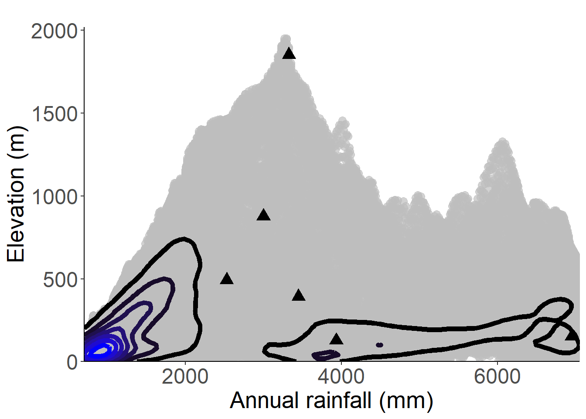

(\#fig:unnamed-chunk-25)Occurrences of Asplenium exhaustum in the climate conditions of São Tomé.

### ``Cyatheaceae``

#### ``Alsophila camerooniana (Hook.) R. M. Tryon var. currorii (Holttum) J. P. Roux``

#### Status {.unnumbered}

#### Rationale {.unnumbered}

*Alsophila camerooniana* var. *currorii* was preliminary assessed as VU D2 (Figueiredo 2002), but not published on the IUCN Red List. This variety is a tree fern up to 3 m in height, endemic to Príncipe Island and found in lowland forest from 60 to 350 altitude. It is known from seven collections made between 1919 (Navel 136) and 1957 (Rose 400). Three of these collections do not have precise coordinates and were excluded from this assessment (Strickland s.n., Curror s.n. and Stévart s.n.). Four specimens of *Alsophila camerooniana* were collected in Príncipe from 1998 and 2016 and need further investigation to check if they can be *Alsophila camerooniana* var. *currorii* (Oliveira 98/177, 515, 1796 and Equipa Botanica do Príncipe 56) and were not used for this assessment. The four collections used for this assessment represent three occurrences, none considered as extirpated and all within Príncipe’s Natural Park (PNP). Based on a 2 x 2 km cell size, the AOO of this species is estimated as 12 km2, below the upper threshold for EN status under subcriterion B2. The EOO is calculated as 5.1 km2, below the upper threshold for CR status under subcriterion B1. Since the EOO cannot be less than the AOO, we consider the EOO as 12 km2 (the same value as AOO), which is below the upper threshold of the CR category under subcriterion B1. The three occurrences (Rio Bambu-Porco, Ôquê Pipi-Morro do Leste and Infante D. Henrique) were threatened by past plantations but are not currently threatened and represent one location and 1-3 subpopulations. *Alsophila camerooniana* var. *currorii* was probably much more widespread in the lowland forests of the South and thus we infer a reduction of the EOO, area of occupancy, and past decline in the extent and quality of its habitat, and a decline in the number of mature individuals. It is thus assessed as CR B1ab(i,ii,iii,iv,v). 

#### Habitat and ecology {.unnumbered}

The species occurs in lowland forest, between 60 and 350 in elevation.

#### Use and trade {.unnumbered}
*Alsophila camerooniana* var. *currorii* is included on the checklist of CITIES species (UNEP-WCM 2011).

#### Population {.unnumbered}
Population information is not sufficiently documented for this species, but we suggest the existence of 1-3 subpopulations.

<iframe src="https://cepf-stp-threat-flora.netlify.app/img/leaflet_Alsophila_camerooniana_var._currorii.html" width="672" height="400px"></iframe>

(\#fig:unnamed-chunk-37)An interactive distribution map.

(\#fig:unnamed-chunk-40)Occurrences of Alsophila camerooniana var. currorii in the climate conditions of Príncipe.

#### ``Alsophila welwitschii (Hook. 1865) R.Tryon``

#### Status {.unnumbered}

#### Rationale {.unnumbered}

*Alsophila welwitschii* is a tree fern up to 1.5 m tall. The species is endemic to the island of São Tomé. It occurs frequently in open forests on wet slopes, and secondary forests, between 100 to 1,850 m. It was previously assessed as VU (D2) by Figueiredo and Gascoigne (2001) because the population was present in a single location. This assessment was never published on the Red List and its date and the collection of new information justify its reassessment.
*Alsophila welwitschii* is known from 42 collections made between 1860 (Welwitsch 66) and 2020 (Lachenaud 2986). Two collections (Mann 41/1, 1104) do not have precise coordinates and were not taken into account for estimating the assessment parameters. The 40 remaining collections represent 29 occurrences, including nine within the PNOST and twenty outside the protected area. The occurrences of Monte Café (Welwitsch 66) and between Bom Sucesso and Lagoa Amélia (Lejoly 300 ; Almeida s.n ; Moller 2) are considered extirpated due to the dates of their collection and the type of activities (small-holder plantations) present around their georeferencing. These four occurrences have also not been taken into account for this assessment. The 25 remaining occurrences represent 1 to 3 subpopulations (the seeds of the species are mainly dispersed by wind). Based on a 2 x 2 km cell size, the AOO is estimated as 76 km², below the upper threshold of the EN status under subcriterion B2. The EOO is calculated as 288.140 km², below the upper threshold of the EN status under subcriterion B1. Two occurrences located outside the PNOST at Rio lo Grande (Ogonovszky 50) and Caminho de Vale Carmo (Figueiredo 157) are threatened by old plantations (cacao) and represent one location. Four occurrences inside PNOST in South (Ogonovszky  125 Between Elmolve and Vila Verde; Paiva 915 Between Juliana de Sousa and S. Miguel; Lachenaud 2986 Hill north of Praia São Miguel; Oliveira 431 Morro Provaz) are threatened by old plantations (cacao) and represent one location. The occurrence in the center of PNOST (Ogonovszky 157) is not threatened and represents one location. The two occurrences to the northwest of the PNOST (Paiva 1355 Diogo Vaz-Sao Manuel; Paiva 1355 Diogo Vaz. Rio Apaga Fogo) are threatened by illegal logging and represent a location. The Cascata Apaga-Foguinh occurrence (Paiva 743) is threatened by small-scale agriculture and represents one location. Occurrences along the tourist trail (Moller 3 and Monod 12010 West slope of Pico; Lejoly 269, 634 Lagoa Amélia; Randrianaivo 1612 Lagoa Amélia) represent one location and are indirectly threatened by ecotourism and invasive species reducing the quality of its habitat. The Formoso Grande (Oliveira 1187), Bombaim-Monte Formoso (Paiva 766), Milagrosa-Bombaim (Figueiredo 181) and Formoso Pequeno (Oliveira 1130) occurrences are threatened by illegal logging, and represents one location. The occurrence of Chamiço (Paiva 1030) is threatened by small-scale agriculture and represents one location. Four occurrences between Zampalma and Trás-os-Montes (Paiva 1110; Oliveira 1125; Henriques s.n; Gama s.n) are threatened by small-scale agriculture and illegal logging and represent one location. The Macambrará (Exell 111) is threatened by small-scale agriculture, and represents one location; we infer a future disappearance of this occurrence. The occurrence between St. Luís and Chamiço (Paiva 456) is threatened by small-scale agriculture and represents one location. Therefore, these 25 occurrences represent 10 locations (sensu IUCN, 2019), with regards to the most important threat (small-scale agriculture). We infer a continuing decline in the extent and quality of its habitat. We also infer a decline in its AOO, the number of mature individuals, and the number of subpopulations based on inferred future disappearance of one occurrence situated at Monte Figo. Therefore, *Alsophila welwitschii* is assessed as VU B1ab(ii,iii,iv,v)+2ab(ii,iii,iv,v).

#### Habitat and ecology {.unnumbered}

The species occurs frequently in open forests on wet slopes, and secondary forests, between 100 and 1,850 m in elevation.

#### Use and trade {.unnumbered}
There are no known uses of this species.

#### Population {.unnumbered}
Very widespread in São Tomé, the species seems to be very present in the center of the island.

<iframe src="https://cepf-stp-threat-flora.netlify.app/img/leaflet_Alsophila_welwitschii.html" width="672" height="400px"></iframe>

(\#fig:unnamed-chunk-50)An interactive distribution map.

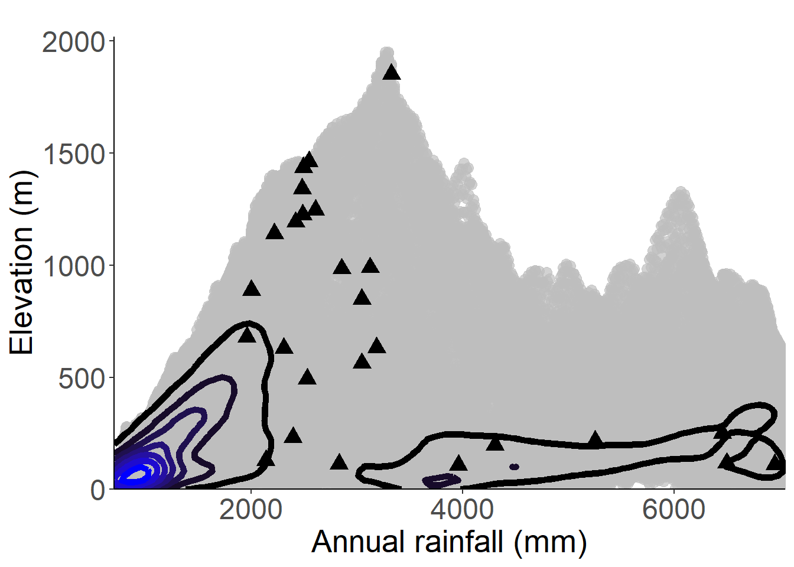

(\#fig:unnamed-chunk-52)Occurrences of Alsophila welwitschii in the climate conditions of São Tomé.

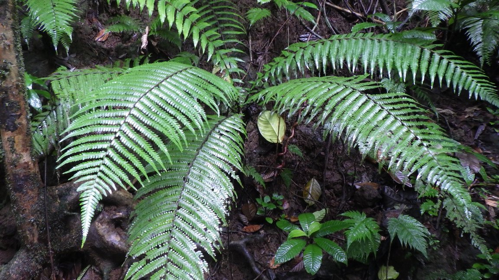

(\#fig:unnamed-chunk-56-1)Copyright 1

(\#fig:unnamed-chunk-56-2)Copyright Lachenaud

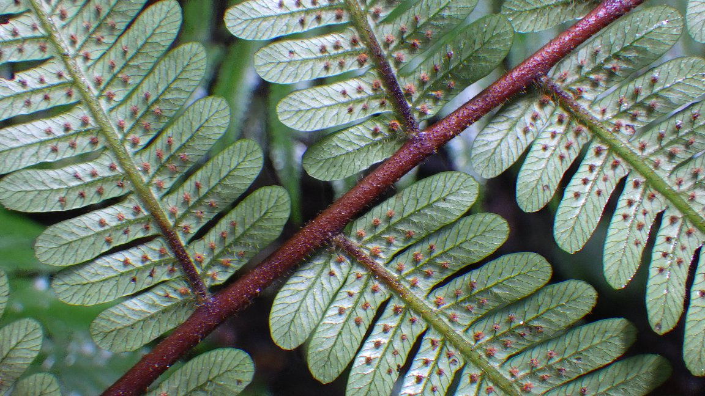

(\#fig:unnamed-chunk-56-3)Copyright 2

(\#fig:unnamed-chunk-56-4)Copyright Lachenaud

### ``Dryopteridaceae``

#### ``Dryopteris caperata J. P. Roux``

#### Status {.unnumbered}

#### Rationale {.unnumbered}

*Dryopteris caperata* is a terrestrial plant, with a rhizome up to 90 mm long, and 10 mm in diameter, known from low and montane rain forest. It is known from 16 collections collected between 1885 (Moller 39) and 1998 (Lejoly 244; Oliveira 485, 624, 644). We consider that two occurrences, corresponding to collections made by Moller (39) and Rozeira (4974) are extirpated given that the habitat has been deeply changed in Nova Moca and Monte Café. Two other collections (Oliveira 136; Quintas 10) were not taken into account in this assessment since they are not precisely georeferenced. So, the 12 remaining collections represent twelve occurrences, two of them occurring in PNOST. Based on a 2 x 2 km cell size, the AOO of this species is estimated as 36 km2, below the upper threshold for EN status under subcriterion B2. The EOO is calculated as 98 km2, below the upper threshold for CR status under subcriterion B1. Two occurrences inside the PNOST, are not threatened and represent one location. The occurrence around Bom Sucesso is threatened by vegetable plantations and represents one location. We infer that this occurrence will disappear in nearly future. Two occurrences at Macambrara and Tras-os-Montes are threatened by agriculture activities and illegal logging and represent one location. Two occurrences made from Bombain and at the base of Pico Formoso were threatened by past coffee plantations and represent one location. The occurrence at Rio Lemba (Santa Catarina) is threatened by human disturbance, and represents one location. The occurrence made at Milagrosa is threatened by human disturbance, and represents one location. The occurrence around Poiso Alto is threatened by agriculture activities and represents one location. The occurrence at Cascata de São Nicolau is not threatened and represents one location. Therefore, these twelve occurrences represent nine locations (sensu IUCN, 2019) with regard to the most serious plausible threats (small-scale agriculture). Based on these threats and the disappearance of two occurrences, we infer past, current and future continuing decline in its AOO, the extent and the quality of its habitat, in number of locations, and number of individuals due to agriculture. *Dryopteris caperata* is thus assessed as VU B1ab(ii,iii,iv,v)+2ab(ii,iii,iv,v).

#### Habitat and ecology {.unnumbered}

The species occurs in lowland and montane rain forest, between 31 and 1,400 m in elevation.

#### Use and trade {.unnumbered}
There are no known uses of this species.

#### Population {.unnumbered}
Population information is not sufficiently known for this species, but we suggest the existence of one subpopulation.

<iframe src="https://cepf-stp-threat-flora.netlify.app/img/leaflet_Dryopteris_caperata.html" width="672" height="400px"></iframe>

(\#fig:unnamed-chunk-64)An interactive distribution map.

(\#fig:unnamed-chunk-66)Occurrences of Dryopteris caperata in the climate conditions of São Tomé.

### ``Dryopteris cicatrica J.P.Roux``

#### Status {.unnumbered}

#### Rationale {.unnumbered}

*Dryopteris cicatricata* is a herbaceous plant up to 1 m, known from the montane forest, between 1,725 and 1,930m in elevation. The species is endemic to São Tomé and is only known from one collection (Razeira 5136) made in 1958. In the literature, it is said that this taxon is only known from the type collection and that there is no problem with taxonomy. Unfortunately, we could not find this herbarium specimen and, therefore, with the information we have, we considered only the type. This collection would represent an occurrence located in the north of the PNOST assuming it still exists. Based on cell size of 2 x 2 km, the area of occupancy is estimated to be 4 km², below the upper threshold for CR status under criterion B2 (the EOO cannot be calculated). This single occurrence must be threatened by tourism and represent 1 location (sensu IUCN, 2019) with regard to the most serious plausible threat (tourism). We infer a past, current and future continuing decline in the extent and habitat quality. *Dryopteris cicatricata* is therefore assessed as CR B2ab(iii).

#### Habitat and ecology {.unnumbered}

The species is known from montane forest, between 1,725 and 1,930 m in elevation.

#### Use and trade {.unnumbered}
There are no known uses of this species.

#### Population {.unnumbered}
The species has only been collected in São Tomé. Its current distribution represents 1 subpopulation.

<iframe src="https://cepf-stp-threat-flora.netlify.app/img/leaflet_Dryopteris_cicatrica.html" width="672" height="400px"></iframe>

(\#fig:unnamed-chunk-77)An interactive distribution map.

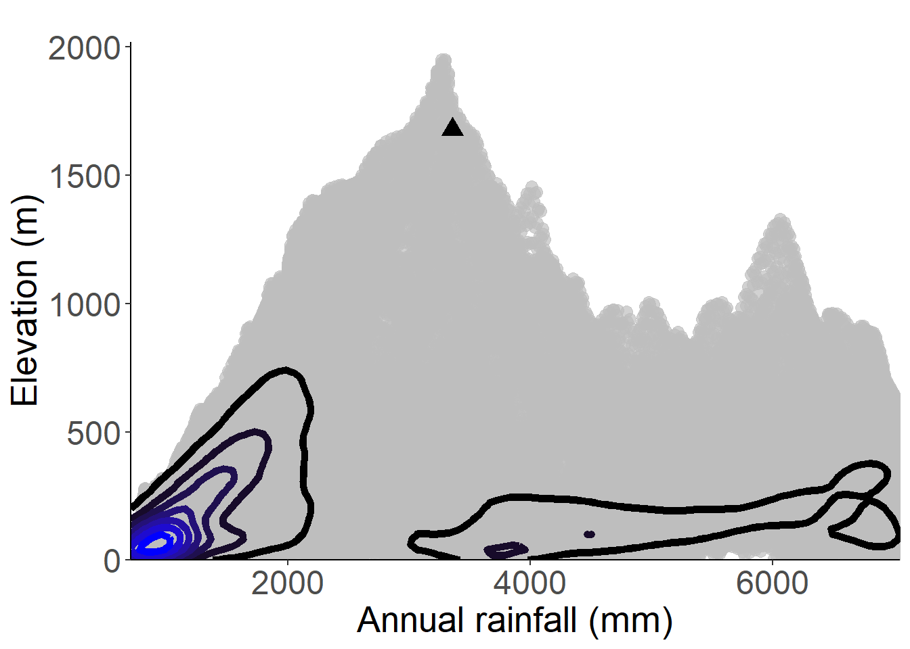

(\#fig:unnamed-chunk-79)Occurrences of Dryopteris cicatrica in the climate conditions of São Tomé.

### ``Polypodiaceae``

#### ``Grammitis nigrocincta Alston``

#### Status {.unnumbered}

#### Rationale {.unnumbered}

*Grammitis nigrocincta* is a fern preliminary assessed as VU D2 but not published on the IUCN Red List (Figueiredo 2002). The species is known from 18 collections made between 1956 (Monod 12162 and Thorold 2017) and 2019 (Barberá 2592), in submontane forests, between 450 and 1,852 m altitude. Two collections do not have precise coordinates and were excluded from this assessment (Rozeira s.n. and Wilde 532). The 16 remaining collections represent 15 occurrences (4 in Príncipe, 1 in São Tomé, 1 in Cameroon, 2 in Equatorial Guinea, 6 in Gabon, and 1 in Congo), none are considered as extirpated and representing seven subpopulations. Based on a 2 x 2 km cell size, the AOO of this species is estimated as 56 km2, below the upper threshold for EN status under subcriterion B2. The EOO is calculated as 229,315 km2, above the upper threshold for VU status under subcriterion B1. In Príncipe three occurrences Pico do Príncipe are not threatened and represent one location, and the occurrence at Pico Papagaio is threatened by tourism causing the decrease of the quality of the habitat and promoting invasive species spread and represents one location. In São Tomé, the only occurrence is at the top of Pico São Tomé and is threatened by tourism causing the decrease of the quality of the habitat and promoting invasive species spread representing one location. In Cameroon, the occurrence is not threatened and represents one location. In Equatorial Guinea, the two occurrences at the Parc National de Monte Alén are not threatened and represent one location. In Gabon, three occurrences around Monts de Cristal are threatened, two by logging and one by small-scale agriculture, each one representing one location. The occurrence in Tchimbélé is threatened by hydroelectric facilities and represents one location. The occurrence on the Komo is threatened by illegal logging and represents one location. In Naguila, the occurrence is not threatened and represents one location. In Congo, the occurrence on Bamba Mountain is not threatened and represents one location. Thus, the 15 occurrences of *Grammitis nigrocincta* represent 11 locations (sensu IUCN, 2019), with regard to the most serious plausible threat (logging). Due to these threats, we infer a continuing decline in the extent and quality of its habitat, almost reaching the threshold of VU status, but which cannot currently lead to consider the species under a threatened category according to criterion B. *Grammitis nigrocincta* is therefore assessed as NT.

#### Habitat and ecology {.unnumbered}

The species occurs in submontane forests, between 450 and 1,852 m in elevation.

#### Use and trade {.unnumbered}
There are no known uses of this species.

#### Population {.unnumbered}
Population information is not sufficiently known for this species, but we suggest the existence of 9 subpopulations.

<iframe src="https://cepf-stp-threat-flora.netlify.app/img/leaflet_Grammitis_nigrocincta.html" width="672" height="400px"></iframe>

(\#fig:unnamed-chunk-91)An interactive distribution map.

(\#fig:unnamed-chunk-93)Occurrences of Grammitis nigrocincta in the climate conditions of São Tomé.

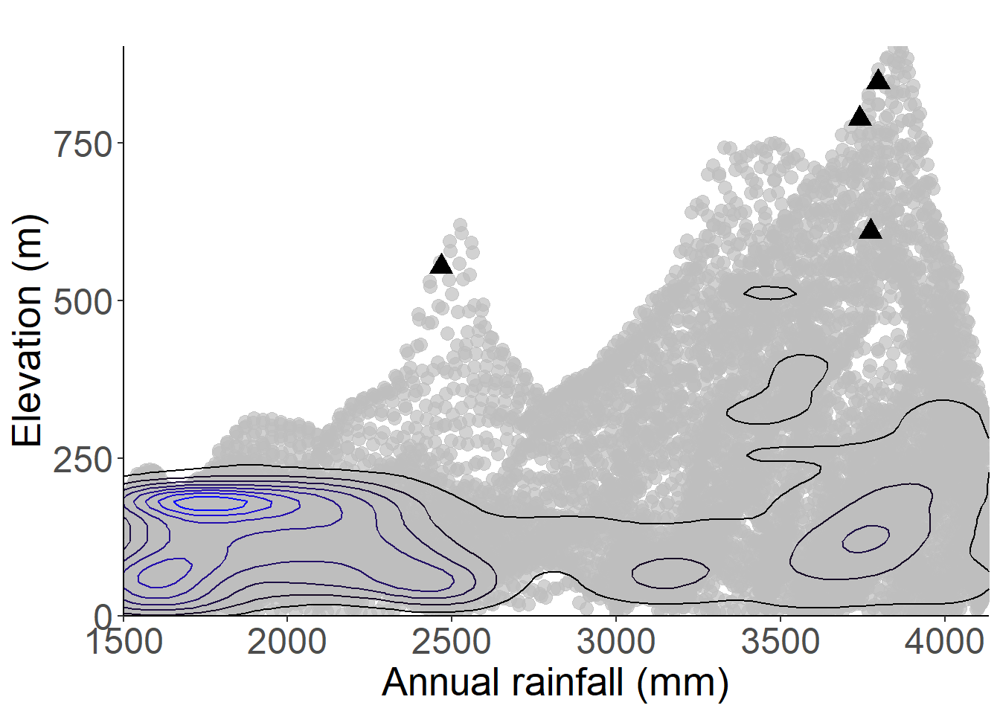

(\#fig:unnamed-chunk-94)Occurrences of Grammitis nigrocincta in the climate conditions of Príncipe.

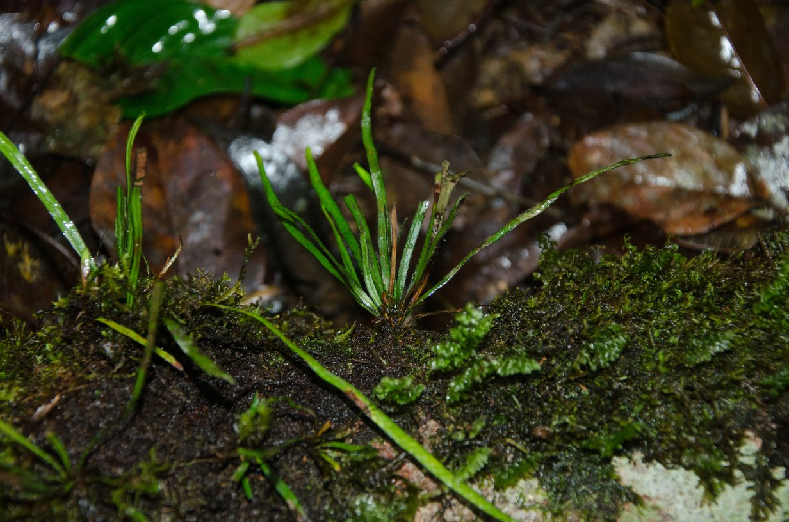

(\#fig:unnamed-chunk-97-1)Copyright 1

(\#fig:unnamed-chunk-97-2)Copyright Bidault

(\#fig:unnamed-chunk-97-3)Copyright 2

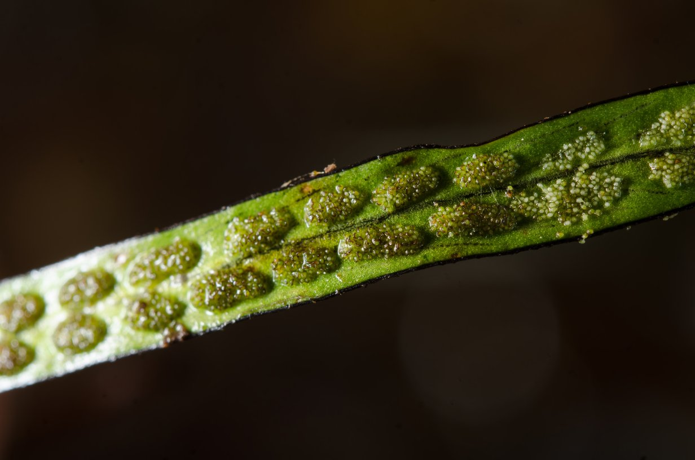

(\#fig:unnamed-chunk-97-4)Copyright Bidault

(\#fig:unnamed-chunk-97-5)Copyright 3

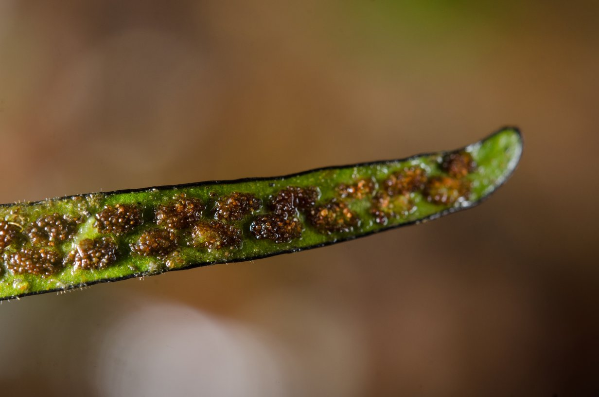

(\#fig:unnamed-chunk-97-6)Copyright Bidault

#### ``Stenogrammitis tomensis``

#### Status {.unnumbered}

#### Rationale {.unnumbered}

*Stenogrammitis tomensis* is an epiphytic fern with rhizome short creeping, scaly, the scales reddish-brown to castaneous (Labiak, 2011). Although two collections (Newton 11; Quintas 11) are often cited, we consider that the attribution of the collection to Newton is a mistake. So, the species is known from only one collection made in 1888 (Quintas 11) around Pico São Tomé. This collection represents one occurrence and one subpopulation. Based on a 2 x 2 km cell size, the AOO of this species is estimated as 4 km2, below the upper threshold for CR status under Criterion B2. The EOO is not calculated. The habitat of the species is threatened by ecotourism activities. Ecotourism is the most important threat and this occurrence represents one location (sensu IUCN, 2019). Based on this threat, we infer past, current and future continuing decline in the extent and the quality of its habitat. *Stenogrammitis tomensis* is thus assessed as CR B2ab(iii).

#### Habitat and ecology {.unnumbered}

The species occurs in submontane rainforest, at 2,000 m in elevation.

#### Use and trade {.unnumbered}
There are no known uses of this species.

#### Population {.unnumbered}
Population information is not precisely known for this species.

<iframe src="https://cepf-stp-threat-flora.netlify.app/img/leaflet_Stenogrammitis_tomensis.html" width="672" height="400px"></iframe>

(\#fig:unnamed-chunk-104)An interactive distribution map.

(\#fig:unnamed-chunk-106)Occurrences of Stenogrammitis tomensis in the climate conditions of São Tomé.

### ``Selaginellaceae``

#### ``Selaginella mannii Baker``

#### Status {.unnumbered}

#### Rationale {.unnumbered}

*Selaginella mannii* is known from lowland and submontane forests, between 600 and 1,900 m in elevation. It is endemic to São Tomé and Príncipe and is known from 19 collections made between 1885 and 1996. We discarded five collections (Moller 80, s.n., Henriques 4, Chevallier 14552, and Mann 1108) prior to the assessment because their locality of collections is unknown or very imprecise. The 14 remaining collections represent nine occurrences and two subpopulations. Based on a 2 x 2 km cell size, the AOO of this species is estimated to be 24 km2, which falls within the limits of the EN category under Criterion B2. The EOO is calculated as 643 km2, below the upper threshold of the EN category under Criterion B1.
Five occurrences of *Selaginella mannii* are located within the PNOST and PNOP on both islands. The habitat of only one of them does not appear under threat, whereas the four other occurrences are threatened by invasive plants. Outside the park, the species is threatened by small-scale shifting agriculture and small-holder farming. Indeed, the occurrence Exell 683 is threatened by invasive plants and trampling and represents one location. The collection Moller s.n., Exell 95, 106, 168, all representing the same occurrence, are threatened by the encroachment of carrot crops and represent one location. The occurrence Monod 11784 is threatened by invasive plants and represents one location. The occurrences Rose 151, Paiva 1101, and 1104 (the last two in the same occurrence) are threatened by shifting agriculture and represent two locations. The collections Monod 11904, Paiva 190, and Moller s.n. located within the park in São Tomé are threatened by invasive plants and trampling. We have not found any threat for the occurrence Moller s.n. located within the park. Based on the smallest size of locations in the currently affected areas by small-holder farming, that occurrence represents one location. 
Based on the main threat which is small-holder farming, the nine occurrences represent seven locations (sensu IUCN 2019), which falls within the limits of the Vulnerable category under the criteria B1 and B2. Shifting agriculture and small-holder farming are leading to a continuing decline in the quality of the species' habitat. The disappearance of the occurrence from São Nicolau leads us to infer a decline in AOO, number of locations, and mature individuals of the species. For these reasons, *Selaginella mannii* is assessed as VU B1ab(ii,iii,iv,v)+2ab(ii,iii,iv,v).

#### Habitat and ecology {.unnumbered}

The species is known from lowland and submontane forests, between 600 and 1,900 m in elevation.

#### Use and trade {.unnumbered}
There are no known uses of this species.

#### Population {.unnumbered}
*Selaginella mannii* is known from two subpopulations. No quantitative population data are available for the species.

<iframe src="https://cepf-stp-threat-flora.netlify.app/img/leaflet_Selaginella_mannii.html" width="672" height="400px"></iframe>

(\#fig:unnamed-chunk-118)An interactive distribution map.

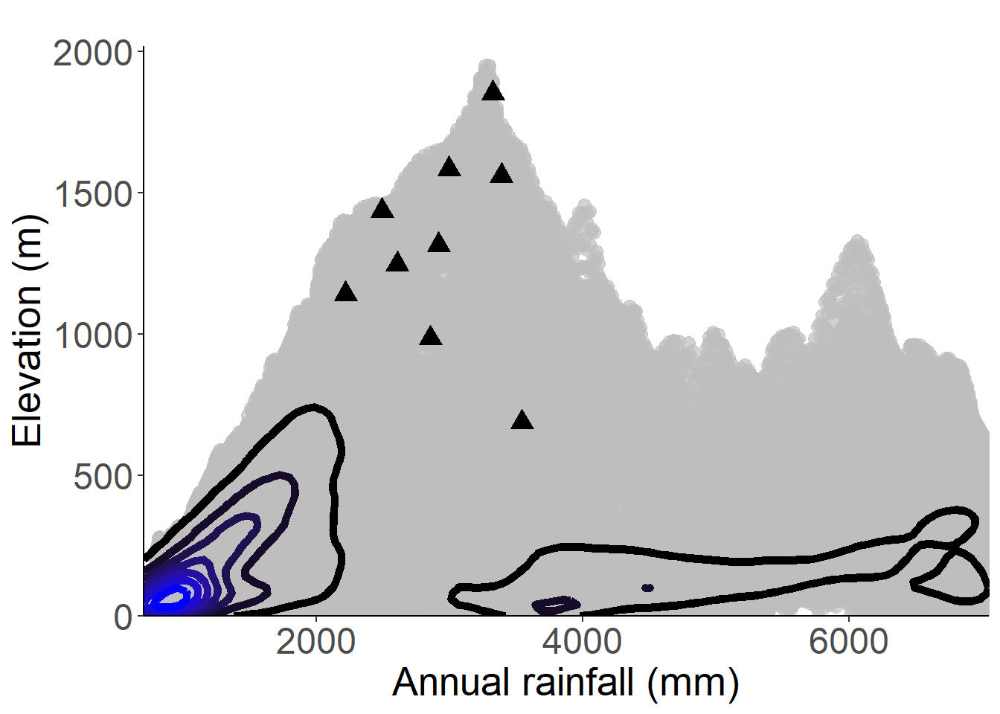

(\#fig:unnamed-chunk-120)Occurrences of Selaginella mannii in the climate conditions of São Tomé.

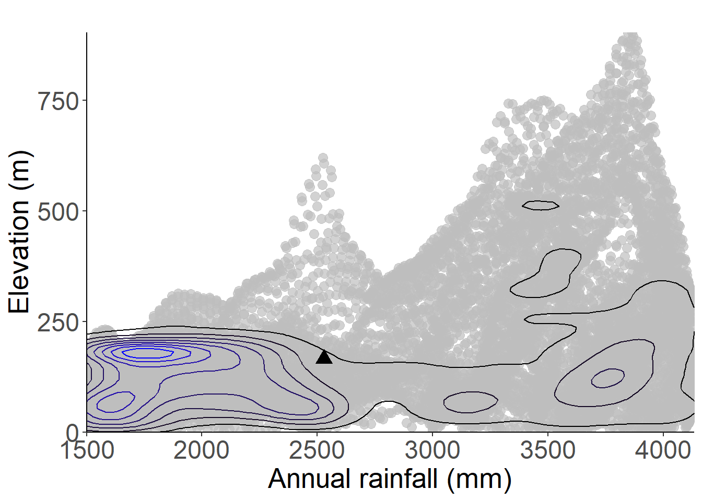

(\#fig:unnamed-chunk-121)Occurrences of Selaginella mannii in the climate conditions of Príncipe.

#### ``Selaginella monodii Alston``

#### Status {.unnumbered}

#### Rationale {.unnumbered}

*Selaginella monodii* was assessed by Figueiredo et Gascoigne (2001) as CR, but this assessment has not been published by the Red List Unit. It is a fern known from six collections made between 1956 (Monod 11806) and 1999 (Figueiredo 167-169; 174). Although the habitat was very degraded in places of collection, we consider that none of all occurrences has been extirpated. So these six collections represent four occurrences (all located outside PNOST), and three subpopulations. Based on a 2 x 2 km cell size, the AOO of this species is estimated as 16 km², below the upper threshold of the EN category under subcriterion B2. The EOO is calculated as 90 km², below the upper threshold of the CR category under subcriterion B1. The occurrence at Bobo Forro (Cascata Blublu) is threatened by urbanization and horticulture activities, and represents one location. The occurrence located at Cascata de Bombaim is not threatened and represents one location. Two occurrences from Generosa and Mendes Leite are threatened by cacao plantations and hydroelectric activities which induce a decline in the number of mature individuals. They represent one location. Therefore, these six occurrences represent three locations (sensu IUCN 2019), with regards to the most important threat (hydroelectric activities). We infer a past and a future decline in the number of mature individuals. Moreover, we infer a past, current, and future continuing decline in the extent and the quality of its habitat. *Selaginella monodii* is thus assessed as EN B1ab(iii,v)+2ab(iii,v).

#### Habitat and ecology {.unnumbered}

The species occurs in low altitude rainforest, on the stones of the stream of waterfalls, between 50 and 600 m in elevation.

#### Use and trade {.unnumbered}
There are no known uses of this species.

#### Population {.unnumbered}
This species appears to be stream-dependent, so the four occurrences (two of which are located on the same stream) represent three subpopulations.

<iframe src="https://cepf-stp-threat-flora.netlify.app/img/leaflet_Selaginella_monodii.html" width="672" height="400px"></iframe>

(\#fig:unnamed-chunk-131)An interactive distribution map.

(\#fig:unnamed-chunk-133)Occurrences of Selaginella monodii in the climate conditions of São Tomé.

### ``Tectariaceae``

#### ``Triplophyllum fraternum (Mett.) Holttum var. elongatum (Hook.) Holttum``

#### Status {.unnumbered}

#### Rationale {.unnumbered}

*Triplophyllum fraternum* var. *elongatum* is a fern assumed to be endemic to Príncipe Island. This variety was listed as rare in the 1997 IUCN Red List of Threatened Plants (Walter and Gillett 1998). It was then assessed as CR by Figueiredo & Gascoigne (2001), but not published in the IUCN Red List. *Triplophyllum fraternum* var. *elongatum* is known from three collections. The locality of the collection made by Mann (s.n.) in 1861 is unknown. According to Holttum (1986), additional specimens exist, collected by Barter and by Curror (s.n.) with no information regarding the collection year, habitat, or locality. Klopper & Figueiredo (2013) consider the variety as rare or extinct since no collections were made since the 19th century. No dedicated survey has been conducted to find the variety, so we can't consider it extinct. The taxon is thus known from few specimens with no locality information so that it is not possible to make any further inference about its conservation status, thus this species is assessed as DD.

#### Habitat and ecology {.unnumbered}

Habitat and ecology are unknown. Collected only in Príncipe Island, in an unknown locality described only as "forest".

#### Use and trade {.unnumbered}
There are no known uses of this species.

#### Population {.unnumbered}
There is no population information for this species.

<iframe src="https://cepf-stp-threat-flora.netlify.app/img/leaflet_Triplophyllum_fraternum_var._elongatum.html" width="672" height="400px"></iframe>

(\#fig:unnamed-chunk-145)An interactive distribution map.

### ``Thelypteridaceae``

#### ``Pseudophegopteris henriquesii (Baker) Christenh.``

#### Status {.unnumbered}

#### Rationale {.unnumbered}

*Pseudophegopteris henriquesii* (Holttum, 1969) is an herb up to 1 m, known from dense humid forest, between 600 and 1,250 m in elevation. The species is endemic to São Tomé. It is known from 10 collections made between 1885 (Moller s.n.; 45; 49) and 1998 (Paiva 1317). However, we excluded two collections because no locality information is provided. The eight remaining collections represent five occurrences and one subpopulation. Considering forest cover, which is still significant in areas of collection, we do not regard any of these five remaining occurrences as extirpated. Based on a 2 x 2 km cell size, the AOO of this species is estimated as 16 km2, below the upper threshold for EN status under subcriterion B2. The EOO is calculated as 2.5 km2, above the upper threshold for CR status under subcriteria B1. Since the EOO is less than the AOO, we consider the EOO equal to the AOO (16 km2), below the upper threshold for CR status. Two occurrences located at Nova Moca are threatened by coffee plantations and represent one location. The occurrence at Zampalma is threatened by horticulture and represents one location. We consider that this occurrence will disappear in the near future. Two occurrences at Rosa Calvario are threatened by plantations and represent one location. Therefore, these five occurrences represent three locations (sensu IUCN, 2019), with regard to the most serious plausible threats (small-scale agriculture). Based on the future disappearance of the occurrence in Zampalma, we infer a continuing decline in its AOO, EOO, the number of locations, the extent and the quality of its habitat, and the number of mature individuals. *Pseudophegopteris henriquesii* is thus assessed as EN B1ab(i,ii,iii iv,v)+2ab(i,ii,iii,iv,v).

#### Habitat and ecology {.unnumbered}

The species is known from dense humid forest, between 600 and 1,250 m in elevation.

#### Use and trade {.unnumbered}
There are no known uses of this species.

#### Population {.unnumbered}
Population information is not very well known for this species.

<iframe src="https://cepf-stp-threat-flora.netlify.app/img/leaflet_Pseudophegopteris_henriquesii.html" width="672" height="400px"></iframe>

(\#fig:unnamed-chunk-159)An interactive distribution map.

(\#fig:unnamed-chunk-161)Occurrences of Pseudophegopteris henriquesii in the climate conditions of São Tomé.

#### ``Sphaerostephanos elatus subsp. thomensis Holttum``

#### Status {.unnumbered}

#### Rationale {.unnumbered}

*Sphaerostephanos elatus* subsp. *thomensis* is a fern most often found on rocks in secondary forests, between 867 and 1,867 m. It is an endemic subspecies of São Tomé, known from 3 collections made between 1885 (Moller 41) and 1995 (Paiva 844). In 1998, Figueiredo emphasized the fact that this species is very rare. These three collections represent 3 occurrences and 1 or 2 subpopulations (the seeds of the species are mainly dispersed by wind).  Based on a 2 x 2 km cell size, the AOO is estimated as 8 km², below the upper threshold of the CR status under subcriterion B2. The EOO is calculated as 0.9 km², below the upper threshold of the CR status under subcriterion B1. Here the EOO is underestimated and therefore it will be equal to the AOO. The pico occurrence (Moller 41) is threatened by invasive plants and ecotourism and represents one location. This can induce degradation of its habitat. The occurrence of São Nicolau (Paiva 304) is threatened by carrot and cabbage fields, which could lead to its future disappearance and represents one location. The Cascata de São Nicolau occurrence (Paiva 844) is not threatened and represents one location. Therefore, these 3 occurrences represent 3 locations (sensu IUCN, 2019). We infer a continuing decline in EOO, AOO, habitat extent, and quality, number of locations, and number of mature individuals. *Sphaerostephanos elatus* subsp. *thomensis* is therefore assessed as EN B1ab(i,ii,iii,iv,v)+2 ab(i,ii,iii,iv,v).

#### Habitat and ecology {.unnumbered}

The species is most often found on rocks in secondary forests, between 867 and 1,867 m in elevation.

#### Use and trade {.unnumbered}
There are no known uses of this species.

#### Population {.unnumbered}
Population information is not precisely known for this subspecies.

<iframe src="https://cepf-stp-threat-flora.netlify.app/img/leaflet_Sphaerostephanos_elatus_subsp._thomensis.html" width="672" height="400px"></iframe>

(\#fig:unnamed-chunk-172)An interactive distribution map.

(\#fig:unnamed-chunk-174)Occurrences of Sphaerostephanos elatus subsp. thomensis in the climate conditions of São Tomé.

## Gymnosperm

### ``Podocarpaceae``

#### ``Afrocarpus mannii``

#### Status {.unnumbered}

#### Rationale {.unnumbered}

The species was previously assessed as VUD2 in 2011. However, new data called for its reassessment. *Afrocarpus mannii* is a tree, up to 35 m tall. It is a light demanding species, found in submontane and montane forest, mostly in open habitat such as ridges, between 1216 and 2024 m in elevation. The species is endemic to São Tomé, occurring in the Northwest-center of the island. It is known from 36 collections made between 1861 (Mann 1065) and 2008 (Randrianaivo, R. 1644), 2 observations made on the MBG Transects, 3 in Macambrará, and 57 field observations (GPS points) made on the whole island. Twenty five specimens were excluded because they are cultivated (mostly around Monte Café and Saudade) or not well georeferenced (between Monte Café and the Pico). Moreover, individuals that were planted along the road of Monte Café were logged, as well as the ones cultivated in São Nicolau and Saudade. Overall, 12 specimens and 53 observations were kept, representing 65 occurrences.
Despite the old age of some collections (Mann 1065 in 1861 for example), we did not exclude any of these 65 occurrences, since the locations are remote and still covered by forest, thus considered as still suitable for the species.
Two large groups of individuals are known in the wild, one around the ridges near Lagoa Amélia, and the other on the ridge from Estação Sousa, to the Pico de São Tomé and to Morro Vilela. These two patches of individuals form one subpopulation since they are quite close (3 km) and individuals certainly exist on ridges linking these two areas (track to Escadas). The number of individuals at the top is quite limited, but the species is frequent: 51 observations of mature individuals have been made there, showing that the species is quite common along ridges, but not abundant in the wild. Indeed, we can estimate that the number of mature individuals does not exceed 1000 individuals based on the 51 observations made along the ridge to the Pico which represent around one third or one quarter of its natural habitat. Also worth noting that most tracks in the area where the species can be found are along the ridges, which is a preferential habitat for the species, making it easy to find.
The species is not directly threatened by logging but its habitat, the submontane and montane forests, has been reduced, especially in the area near Bom Sucesso, where many new crop settlements were established starting around 1980. The species was also collected near Macambrará, on the ridge, a place that is also threatened by horticulture.
Most of the about 300-400 individuals recently cultivated in the nursery of Bom Sucesso originated from young seedlings collected at Morro Esperança, near Lagoa Amélia.
Most herbarium specimens and observations were collected in the PNOST. Despite the quality of its timber, none of these places appears to be directly threatened.
The occurrences located near Macambrará are threatened by agricultural expansion and represent one location. Individuals found between Bom Sucesso and Lagoa Amélia are also threatened by agricultural expansion and by the invasive species that it promotes, and they represent one location. Finally, individuals situated at higher elevation within the protected area do not appear to be under any direct or immediate threat, and represent one location based one the impacted area of the most important threat, agriculture.
Since the habitat remains unaltered in the places of collection, and most of the occurrences are recent, we consider that the species persists in all places of occurrence. The habitat of the species does not appear to be fragmented. Based on a 2 x 2 km cell size, the AOO of this species is estimated at 28 km², and the EOO is calculated at 14.6 km², both below the upper threshold for EN status under Criterion B. The EOO is estimated to be lower than the AOO, so we consider EOO equal to the AOO (28 km²), both below the upper threshold for EN status under Criterion B.
Therefore, these 65 occurrences represent 3 locations (sensu IUCN 2019), with regards to the most important threats (small scale agriculture). Moreover, we infer a past decline of the AOO and mature individuals, and a past, current, and future continuous decline in the extent and habitat quality. Finally, the whole population of the species is situated in 1 subpopulation. This species is thus assessed as EN B1ab(ii,iii,v)+2ab(ii,iii,v); C2a(ii).

#### Habitat and ecology {.unnumbered}

*Afrocarpus mannii* is endemic to the volcanic montane of Pico de São Tomé from ca 1,216 m to the summit at 2,024 m asl. It is nowhere a large tree and at the summit it is reduced to dwarfed krummholz. It is frequent in the high montane cloud forest, which has remained almost undisturbed, especially above ca 1,500 m.
The habitat of the species is the submontane and montane rainforest, along ridges, open montane forest, and along tracks. The species is cultivated at lower altitude in plantations or as ornamental (Porto Alegre in São Tomé, Libreville).

#### Use and trade {.unnumbered}
The timber of *Afrocarpus mannii* is valuable in well-shaped large trees, which have become scarce. It is used for light construction. This species has been planted in rural areas in Cameroon and Côte d'Ivoire and probably elsewhere in West Africa as a canopy tree or windbreak for coffee plantations and as an amenity tree in villages. The local name is Pinheiro de São Tomé and it is used to treat coughs.
Some individuals have been planted at CIAT station, around 39 years ago, and they now have about 30 cm in DBH. They were producing fruits after 30 years. Many young seedlings (10 cm tall) have been collected around Lagoa Amélia (Esperança) and planted in the nursery of the Bom Sucesso Botanical Garden (10 individuals were transplanted to the garden). After 4 years, they were about 150 cm tall. Between 300 to 400 seedlings have been delivered to communities as timber trees, but no precise localities are given (Projects CARPE, ECOFAC6, FFEM).

#### Population {.unnumbered}
The population of this species is naturally small as it is confined to the ridges of a single mountain. At lower altitudes, larger trees have been felled, but they were cultivated. The number of mature individuals is less than 1000. Around 300-400 individuals have been planted these last 10 years in São Tomé.

<iframe src="https://cepf-stp-threat-flora.netlify.app/img/leaflet_Afrocarpus_mannii.html" width="672" height="400px"></iframe>

(\#fig:unnamed-chunk-187)An interactive distribution map.

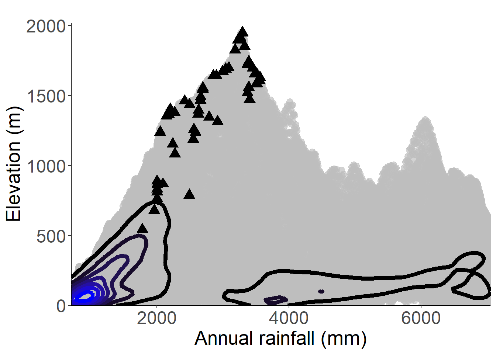

(\#fig:unnamed-chunk-189)Occurrences of Afrocarpus mannii in the climate conditions of São Tomé.

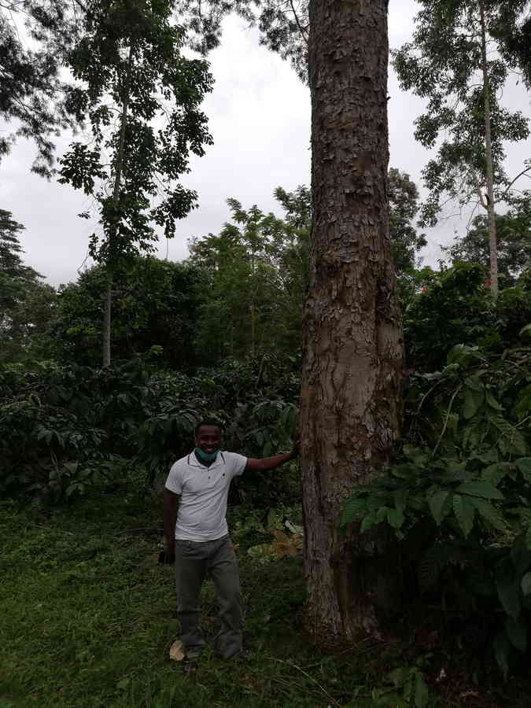

(\#fig:unnamed-chunk-193-1)Copyright Stévart

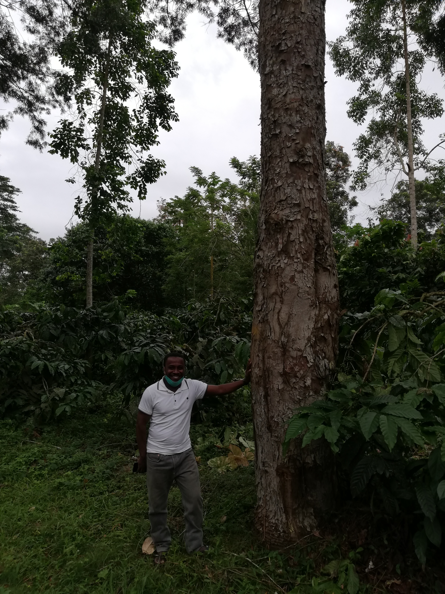

(\#fig:unnamed-chunk-193-2)Copyright Stévart

