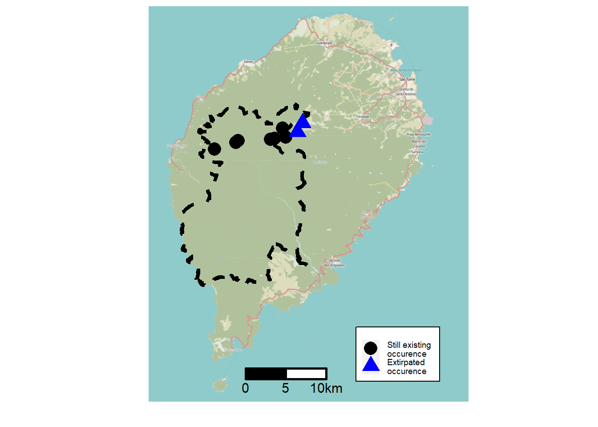
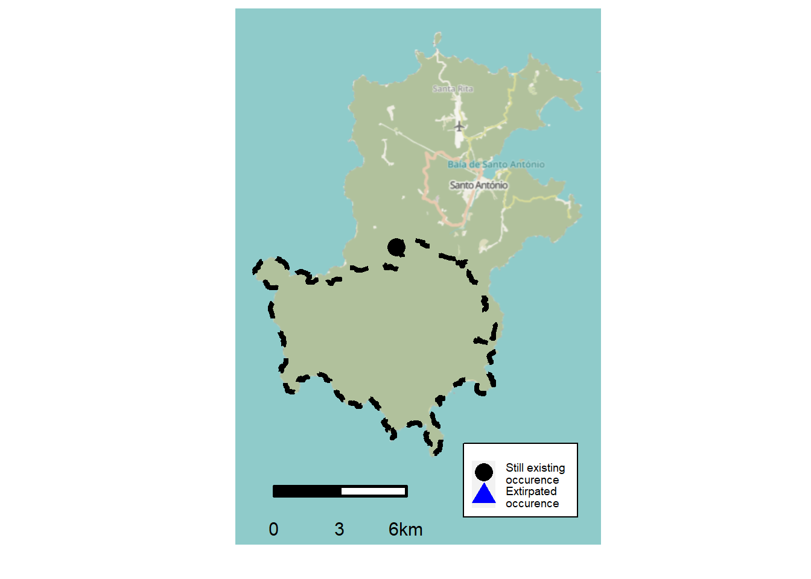
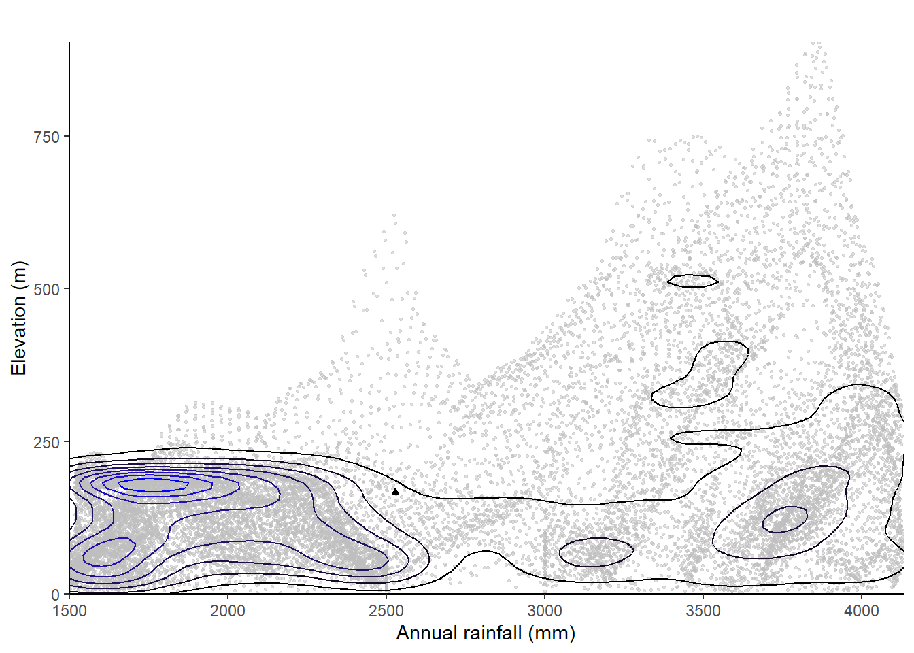
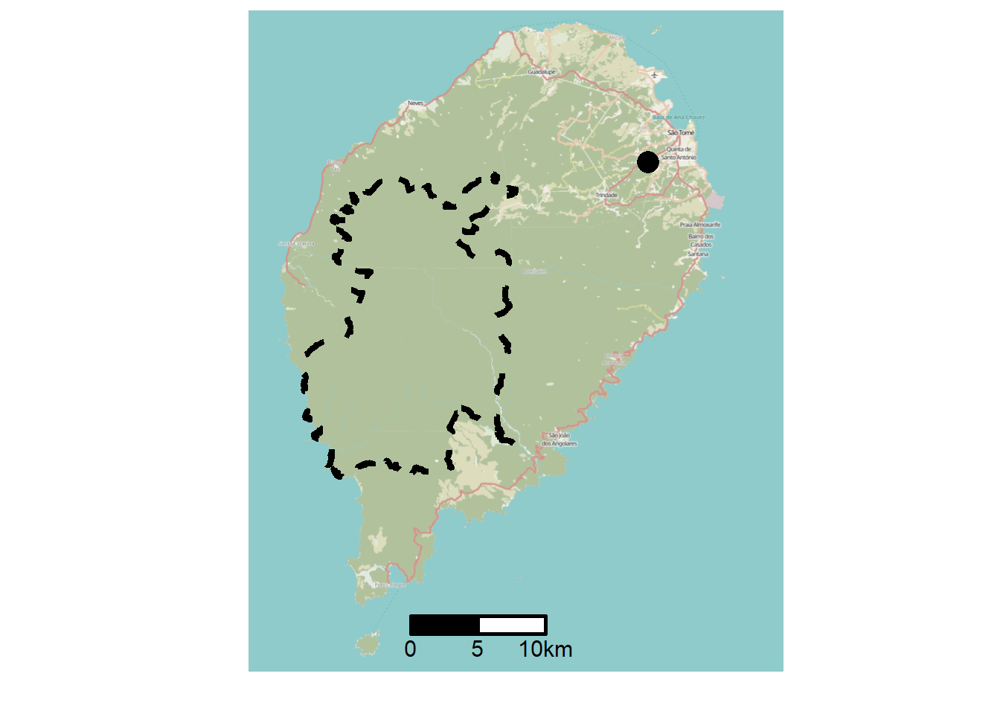
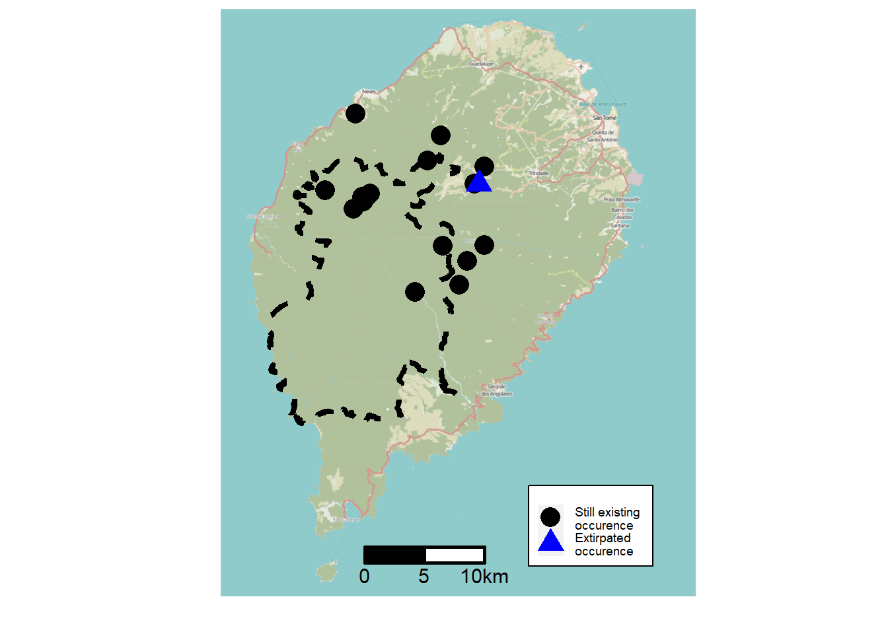
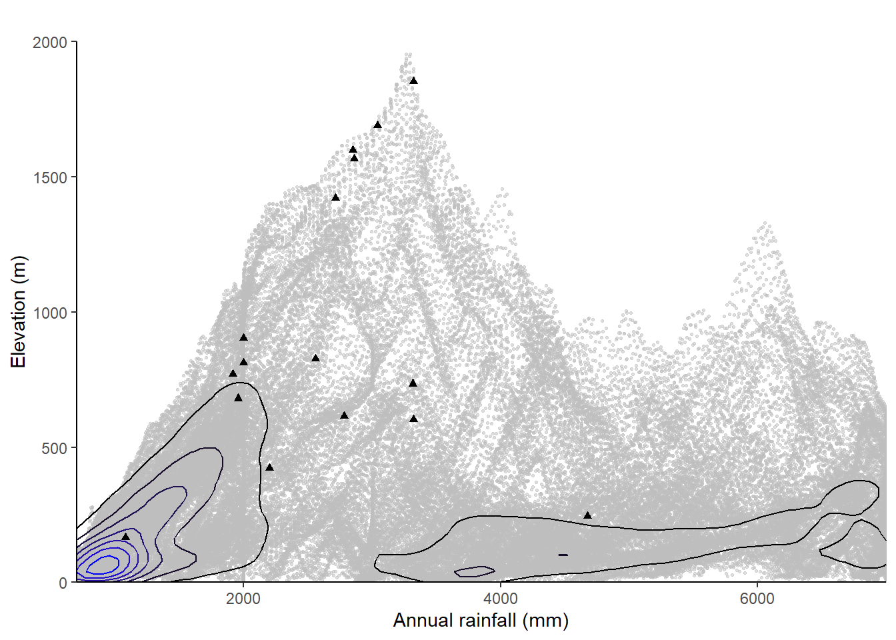

# Checklist {#sp-list}

# Pteropsida {.unnumbered}

## ``Aspleniaceae``

### ``Asplenium eurysorum Hieron.``

#### Status {.unnumbered}

#### Rationale {.unnumbered}

*``Asplenium eurysorum``* is an epiphyte fern. The species is known from Gabon and the islands of São Tomé and Príncipe. It occurs frequently within dense, tall, very wet forests with submontane affinity on rock faces in terra firme forest on ridge, between 160 and 1,987 m in elevation. It was previously assessed as VU (D2) by Figueiredo and  Gascoigne (2001), as the population was present in two locations, São Tomé and Príncipe (D2). This assessment was never published on the Red List and its date and the collection of new information justify its reassessment.
*``Asplenium eurysorum``* is known from 31 collections made between 1853 (*Welwitsch* 14; Watt 14) and 2018 (*Bidault* 3983). One collection (*Barter* 1896) does not have precise coordinates and was not taken into account for estimate the assessment parameters. The 30 remaining collections represent 19 occurrences. In São Tomé, there are fifteen occurrences, eight of which are located within the Ôbo Natural Park of São Tomé (PNOST), one outside PNOST to the southeast, and the six others to the northeast outside PNOST. However, the occurrence of São Pedro-Lagoa Amélia (*Monod* 11714) is considered extirpated and therefore was not taken into account for this assessment. In Príncipe, there are three occurrences, two inside the Ôbo Natural Park of Príncipe (PNOST) and one outside. The occurrence in Gabon is located within the Ramsar site of Birougou. The 18 remaining occurrences represent 3 subpopulations (the seeds of the species are mainly dispersed by wind). Based on a 2 x 2 km cell size, the AOO is estimated as 64 km², below the upper threshold of the "Endangered" status under subcriterion B2. The EOO is calculated as 65,392.750 km², above the upper threshold of the “Vulnerable” status under subcriterion B1. The two occurrences south of PNOST (*Oliveira* 424 and *Espirito Santo* 5139) are threatened by old cocoa plantations and represent one location. The occurrence that is southeast of São Tomé (*Oliveira* 1419) is threatened by small-scale agriculture and represents one location. The two occurrences between Zampalma and Calvario (*Oliveira* 1461 and Espirito Santo 5070) are threatened by small-scale agriculture and illegal logging and represent one location. The occurrence of Macambrara (*Exell* 132) is threatened by vegetable agriculture and represents one location. We infer a future disappearance of this occurrence. All occurrences that are in the path of tourists in the PNOST (*Gascoigne* 10, *Oliveira* 1212, *Paiva* 883, *Sousa* 1267, *Stévart* 1267, *Moller* 28, *Lejoly* 1, *Matos* 7382) are indirectly threatened by ecotourism and invasive plants and represent one location. The occurrence in the north, on the periphery of the PNOST (*Paiva* 467) is threatened by small-scale agriculture and illegal logging and represents one location. The occurrence between São Joaquim and São Carlos de Fundão (*Gascoigne* 35) in the PNOP is not threatened and represents one location. The occurrence at Pico Papagaio (*Watt* 24, *Welwitsch* 14 and *Paiva* 595) is indirectly threatened by ecotourism and represents one location. The third occurrence of Príncipe at Ôquê Nazaré (*Newton* 27) is threatened by old cocoa plantations and quarries and represents one location. The occurrence of Gabon (*Bidault* 3983) is not threatened and represents one location. Therefore, these 18 occurrences represent 10 locations (*sensu* IUCN, 2019), with regards to the most important threat (small-scale agriculture). We infer a continuing decline in the extent and quality of its habitat. We also infer a continuing decline in its AOO, the number of mature individuals, and the number of subpopulations based on inferred future disappearance of one occurrence situated at Macambrara. Therefore, *``Asplenium eurysorum``* is assessed as VU B2ab(ii,iii,iv,v).

#### Habitat and ecology {.unnumbered}

The species occurs frequently within dense, tall, very wet forests with submontane affinity on rock faces in *terra firme* forest on ridge, between 160 and 1,987 m in elevation.

(\#fig:unnamed-chunk-7)Distribution of Asplenium eurysorum in São Tomé.

(\#fig:unnamed-chunk-8)Distribution of Asplenium eurysorum in Príncipe.

<iframe src="https://cepf-stp-threat-flora.netlify.app/img/leaflet_Asplenium_eurysorum.html" width="672" height="400px"></iframe>

(\#fig:unnamed-chunk-9)An interactive distribution map.

(\#fig:unnamed-chunk-11)Occurrences of Asplenium eurysorum in the climate conditions of São Tomé.

(\#fig:unnamed-chunk-12)Occurrences of Asplenium eurysorum in the climate conditions of Príncipe.

#### Use and trade {.unnumbered}
There are no known uses of this species.

#### Population {.unnumbered}
The species has been collected more in São Tomé than in Príncipe and Gabon where it is under-collected. Its current distribution represents 3 subpopulations.

### ``Asplenium exhaustum (H. Christ) Alston``

#### Status {.unnumbered}

#### Rationale {.unnumbered}

[*``Asplenium exhaustum``*](https://tropicos.org/name/100487131) is an epiphytic fern, most often found in old plantations and also in secondary forests, between 110 and 1,120 m in elevation. It is an endemic species of São Tomé. A preliminary evaluation was already made by *Figueiredo* and *Gascoigne* in 2001, who evaluated it as EN. The species is known from 13 collections made between 1905 (*Chevalier* 14587) and 2008 (*Oliveira* 1348, 1432). Five of these collections do not have precise coordinates and were not taken into account for estimate the assessment parameters. The seven remaining collections represent 6 occurrences and 1 subpopulation (the seeds of the species are mainly dispersed by wind). Based on a 2 x 2 km cell size, the AOO is estimated as 24 km², below the upper threshold of the “Endangered” status under subcriterion B2. The EOO is calculated as 146.357 km², below the upper threshold of the “Endangered” status under subcriterion B1. The occurrence (*Oliveira* 1348) in the south of the Ôbo to São Tomé Natural Park (PNOST) is not threatened and represents one location. The occurrence that is located between Valcarmo and Roça S. João (*Oliveira* 1432) is threatened by small-scale agriculture and oil palm plantations and represents one location. We infer a future disappearance of this occurrence due to the oil palm plantation project in this locality. The Roça Cruzeiro occurrence (*Thorold* 2072 and *Strickland* 2072) is threatened by small-scale agriculture and illegal logging and represents one location. The area around the Ecofac Center (*Oliveira* 98) and the area between Boom sucesso and Bombaim are threatened by small-scale agriculture and illegal logging and represent one location. The pico occurrence (*Chevalier* 14587) is threatened indirectly by invasive plants and represents one location. Therefore, the 6 occurrences represent 5 locations (sensu IUCN, 2019). We infer a continuing decline in EOO, AOO, habitat extent, and quality, number of locations, and number of mature individuals. The species is therefore assessed as EN B1ab(i,ii,iii,iv,v)+2 ab(i,ii,iii,iv,v).

#### Habitat and ecology {.unnumbered}

The species is most often found in old plantations, as well as in secondary forests, between 110 and 1,120 m in elevation.

(\#fig:unnamed-chunk-18)Distribution of Asplenium exhaustum in São Tomé.

<iframe src="https://cepf-stp-threat-flora.netlify.app/img/leaflet_Asplenium_exhaustum.html" width="672" height="400px"></iframe>

(\#fig:unnamed-chunk-20)An interactive distribution map.

(\#fig:unnamed-chunk-22)Occurrences of Asplenium exhaustum in the climate conditions of São Tomé.

#### Use and trade {.unnumbered}
There are no known uses of this species.

#### Population {.unnumbered}
Population information is not precisely known for this species.

## ``Cyatheaceae``

### ``Alsophila camerooniana (Hook.) R. M. Tryon var. currorii (Holttum) J. P. Roux``

#### Status {.unnumbered}

#### Rationale {.unnumbered}

#### Habitat and ecology {.unnumbered}

(\#fig:unnamed-chunk-31)Distribution of Alsophila camerooniana var. currorii in Príncipe.

<iframe src="https://cepf-stp-threat-flora.netlify.app/img/leaflet_Alsophila_camerooniana_var._currorii.html" width="672" height="400px"></iframe>

(\#fig:unnamed-chunk-32)An interactive distribution map.

(\#fig:unnamed-chunk-35)Occurrences of Alsophila camerooniana var. currorii in the climate conditions of Príncipe.

#### Use and trade {.unnumbered}

#### Population {.unnumbered}

### ``Alsophila welwitschii (Hook. 1865) R.Tryon``

#### Status {.unnumbered}

#### Rationale {.unnumbered}

#### Habitat and ecology {.unnumbered}

(\#fig:unnamed-chunk-41)Distribution of Alsophila welwitschii in São Tomé.

<iframe src="https://cepf-stp-threat-flora.netlify.app/img/leaflet_Alsophila_welwitschii.html" width="672" height="400px"></iframe>

(\#fig:unnamed-chunk-43)An interactive distribution map.

(\#fig:unnamed-chunk-45)Occurrences of Alsophila welwitschii in the climate conditions of São Tomé.

#### Use and trade {.unnumbered}

#### Population {.unnumbered}

## ``Dryopteridaceae``

### ``Dryopteris caperata J. P. Roux``

#### Status {.unnumbered}

#### Rationale {.unnumbered}

*``Dryopteris caperata``* is a terrestrial plant, with rhizome up to 90 mm long, and 10 mm in diameter, known from low and montane rain forest. It is known from 16 collections collected between 1885 (*Moller* 39) and 1998 (*Lejoly* 244; *Oliveira* 485, 624, 644). We consider that two occurrences, corresponding to collections made by *Moller* (39) and *Rozeira* (4974) are extirpated given that the habitat has been deeply changed in Nova Moca and Monte Café. Two other collections (*Oliveira* 136; *Quintas* 10) were not taken into account in this assessment since they are not precisely georeferenced. So, the 12 remaining collections represent twelve occurrences, two of them occurs in Parque Natural de Obô de São Tomé (PNOST). Based on a 2 x 2 km cell size, the AOO of this species is estimated as 36 km², below the upper threshold for “Endangered” status under subcriterion B2. The EOO is calculated as 98 km2, below the upper threshold for “Critically Endangered” status under subcriterion B1. Two occurrences inside the PNOST, are not threatened and represent one location. The occurrence around Bom Sucesso is threatened by vegetable plantations and represents one location. We infer that this occurrence will disappear in nearly future. Two occurrences at Macambrara and Tras-os-Montes are threatened by agriculture activities and illegal logging and represent one location. Two occurrences made from Bombain and base of Pico Formoso were threatened by past coffee plantations and represent one location. The occurrence at Rio Lemba (Santa Catarina) is threatened by human disturbance, and represents one location. The occurrence made at Milagrosa is threatened by human disturbance, and represents one location. The occurrence around Poiso Alto is threatened by agriculture activities and represents one location. The occurrence at Cascata de Sao Nicolau is not threatened and represents one location. Therefore, these twelve occurrences represent nine locations (sensu IUCN, 2019) with regard to the most serious plausible threats (small-scale agriculture). Based on these threats and the disappearance of two occurrences, we infer past, current and future continuing decline in its AOO, the extent and the quality of its habitat, in number of locations, and number individuals due to agriculture. *``Dryopteris caperata``* is thus assessed as VU B1ab(ii,iii,iv,v)+2ab(ii,iii,iv,v).

#### Habitat and ecology {.unnumbered}

The species occurs in low and montane rain forest, between 31 and 1,400 m in elevation.

(\#fig:unnamed-chunk-53)Distribution of Dryopteris caperata in São Tomé.

<iframe src="https://cepf-stp-threat-flora.netlify.app/img/leaflet_Dryopteris_caperata.html" width="672" height="400px"></iframe>

(\#fig:unnamed-chunk-55)An interactive distribution map.

(\#fig:unnamed-chunk-57)Occurrences of Dryopteris caperata in the climate conditions of São Tomé.

#### Use and trade {.unnumbered}
There are no known uses of this species.

#### Population {.unnumbered}

Population information is not sufficiently known for this species, but we suggest existence of one subpopulation.

### ``Dryopteris cicatrica J.P.Roux``

#### Status {.unnumbered}

#### Rationale {.unnumbered}

*``Dryopteris cicatrica``* 

#### Habitat and ecology {.unnumbered}

The species occurs in low and montane rain forest, between 31 and 1,400 m in elevation.

(\#fig:unnamed-chunk-64)Distribution of Dryopteris cicatrica in São Tomé.

<iframe src="https://cepf-stp-threat-flora.netlify.app/img/leaflet_Dryopteris_cicatrica.html" width="672" height="400px"></iframe>

(\#fig:unnamed-chunk-66)An interactive distribution map.

(\#fig:unnamed-chunk-68)Occurrences of Dryopteris cicatrica in the climate conditions of São Tomé.

#### Use and trade {.unnumbered}
There are no known uses of this species.

#### Population {.unnumbered}

## ``Polypodiaceae``

### ``Grammitis nigrocincta Alston``

#### Status {.unnumbered}

#### Rationale {.unnumbered}

*``Grammitis nigrocincta``* 

#### Habitat and ecology {.unnumbered}

(\#fig:unnamed-chunk-76)Distribution of Grammitis nigrocincta in São Tomé.

(\#fig:unnamed-chunk-77)Distribution of Grammitis nigrocincta in Príncipe.

<iframe src="https://cepf-stp-threat-flora.netlify.app/img/leaflet_Grammitis_nigrocincta.html" width="672" height="400px"></iframe>

(\#fig:unnamed-chunk-78)An interactive distribution map.

(\#fig:unnamed-chunk-80)Occurrences of Grammitis nigrocincta in the climate conditions of São Tomé.

(\#fig:unnamed-chunk-81)Occurrences of Grammitis nigrocincta in the climate conditions of Príncipe.

#### Use and trade {.unnumbered}

#### Population {.unnumbered}

### ``Stenogrammitis tomensis``

#### Status {.unnumbered}

#### Rationale {.unnumbered}

*``Stenogrammitis tomensis``* is an epiphytic fern with rhizome short creeping, scaly, the scales reddish-brown to castaneous (*Labiak*, 2011). Although two collections (*Newton* 11; *Quintas* 11) are often cited, we consider that the attribution of the collection to *Newton* is a mistake. So, the species is known from only one collection made in 1888 (*Quintas* 11) around Pico São Tomé. This collection represents one occurrence and one subpopulation. Based on a 2 x 2 km cell size, the AOO of this species is estimated as 4 km², below the upper threshold for “Critically Endangered” status under Criterion B2. The EOO is not calculated. The habitat of the species is threatened by ecotourism activities. Ecotourism is the most important threat and this occurrence represents one location (*sensu* IUCN, 2019). Based on this threat, we infer past, current and future continuing decline in the extent and the quality of its habitat. *``Stenogrammitis tomensis``* is thus assessed as CR B2ab(iii).

#### Habitat and ecology {.unnumbered}

The species occurs in sub-montane rainforest, at 2,000 m in elevation.

(\#fig:unnamed-chunk-87)Distribution of Stenogrammitis tomensis in São Tomé.

<iframe src="https://cepf-stp-threat-flora.netlify.app/img/leaflet_Stenogrammitis_tomensis.html" width="672" height="400px"></iframe>

(\#fig:unnamed-chunk-89)An interactive distribution map.

(\#fig:unnamed-chunk-91)Occurrences of Stenogrammitis tomensis in the climate conditions of São Tomé.

#### Use and trade {.unnumbered}
It is not known if the species is used.

#### Population {.unnumbered}

Population information is not precisely known for this species.

## ``Tectariaceae``

### ``Triplophyllum fraternum (Mett.) Holttum var. elongatum (Hook.) Holttum``

#### Status {.unnumbered}

#### Rationale {.unnumbered}

*``Triplophyllum fraternum var. elongatum``* 

#### Habitat and ecology {.unnumbered}

<iframe src="https://cepf-stp-threat-flora.netlify.app/img/leaflet_Triplophyllum_fraternum_var._elongatum.html" width="672" height="400px"></iframe>

(\#fig:unnamed-chunk-101)An interactive distribution map.

#### Use and trade {.unnumbered}

#### Population {.unnumbered}

## ``Thelypteridaceae``

### ``Pseudophegopteris henriquesii (Baker) Christenh.``

#### Status {.unnumbered}

#### Rationale {.unnumbered}

*``Pseudophegopteris henriquesii``* 

#### Habitat and ecology {.unnumbered}

(\#fig:unnamed-chunk-111)Distribution of Pseudophegopteris henriquesii in São Tomé.

<iframe src="https://cepf-stp-threat-flora.netlify.app/img/leaflet_Pseudophegopteris_henriquesii.html" width="672" height="400px"></iframe>

(\#fig:unnamed-chunk-113)An interactive distribution map.

(\#fig:unnamed-chunk-115)Occurrences of Pseudophegopteris henriquesii in the climate conditions of São Tomé.

#### Use and trade {.unnumbered}

#### Population {.unnumbered}

### ``Sphaerostephanos elatus subsp. thomensis Holttum``

#### Status {.unnumbered}

#### Rationale {.unnumbered}

*``Sphaerostephanos elatus subsp. thomensis``* 

#### Habitat and ecology {.unnumbered}

(\#fig:unnamed-chunk-122)Distribution of Sphaerostephanos elatus subsp. thomensis in São Tomé.

<iframe src="https://cepf-stp-threat-flora.netlify.app/img/leaflet_Sphaerostephanos_elatus_subsp._thomensis.html" width="672" height="400px"></iframe>

(\#fig:unnamed-chunk-124)An interactive distribution map.

(\#fig:unnamed-chunk-126)Occurrences of Sphaerostephanos elatus subsp. thomensis in the climate conditions of São Tomé.

#### Use and trade {.unnumbered}

#### Population {.unnumbered}

#### Status {.unnumbered}

#### Rationale {.unnumbered}

*``Pseudophegopteris henriquesii``* 

#### Habitat and ecology {.unnumbered}

(\#fig:unnamed-chunk-133)Distribution of Pseudophegopteris henriquesii in São Tomé.

<iframe src="https://cepf-stp-threat-flora.netlify.app/img/leaflet_Pseudophegopteris_henriquesii.html" width="672" height="400px"></iframe>

(\#fig:unnamed-chunk-135)An interactive distribution map.

(\#fig:unnamed-chunk-137)Occurrences of Pseudophegopteris henriquesii in the climate conditions of São Tomé.

#### Use and trade {.unnumbered}

#### Population {.unnumbered}

# Lycopsida {.unnumbered}

## ``Selaginellaceae``

### ``Selaginella mannii Baker``

#### Status {.unnumbered}

#### Rationale {.unnumbered}

*``Selaginella mannii``* 

#### Habitat and ecology {.unnumbered}

(\#fig:unnamed-chunk-146)Distribution of Selaginella mannii in São Tomé.

(\#fig:unnamed-chunk-147)Distribution of Selaginella mannii in Príncipe.

<iframe src="https://cepf-stp-threat-flora.netlify.app/img/leaflet_Selaginella_mannii.html" width="672" height="400px"></iframe>

(\#fig:unnamed-chunk-148)An interactive distribution map.

(\#fig:unnamed-chunk-150)Occurrences of Selaginella mannii in the climate conditions of São Tomé.

(\#fig:unnamed-chunk-151)Occurrences of Selaginella mannii in the climate conditions of Príncipe.

#### Use and trade {.unnumbered}

#### Population {.unnumbered}

### ``Selaginella monodii Alston``

#### Status {.unnumbered}

#### Rationale {.unnumbered}

*``Selaginella monodii``* was assessed by Figueiredo et Gascoigne (2001) as CR, but this assessment has not been published by the Red List Unit. It is a fern known from six collections made between 1956 (*Monod* 11806) and 1999 (*Figueiredo* 167-169; 174). Although the habitat was very degraded in places of collection, we consider that none of all occurrences has been extirpated. So these six collections represent four occurrences (all located outside Park Natural de Obô de São Tomé), and three subpopulations. Based on a 2 x 2 km cell size, the AOO of this species is estimated as 16 km2, below the upper threshold of the “Endangered” category under subcriterion B2. The EOO is calculated as 90 km2, below the upper threshold of the “Critically Endangered” category under subcriterion B1. The occurrence at Bobo Forro (Cascada Blublu) is threatened by urbanization and horticulture activities, and represents one location. The occurrence located at Cascada de Bombain is not threatened and represents one location. Two occurrences from Generosa and Mendes Leite are threatened by cacao plantations and hydroelectric activities which induce a decline in the number of mature individuals. They represent one location. Therefore, these six occurrences represent three locations (*sensu* IUCN 2019), with regards to the most important threat (hydroelectric activities). We infer a past and a future decline in the number of mature individuals. Moreover, we infer a past, current, and future continuing decline in the extent and the quality of its habitat. *``Selaginella monodii``* is thus assessed as EN B1ab(iii,v)+2ab(iii,v).

#### Habitat and ecology {.unnumbered}

The species occurs in low altitude rainforest, on the stones of the stream of waterfalls, between 50 and 600 m in elevation.

(\#fig:unnamed-chunk-157)Distribution of Selaginella monodii in São Tomé.

<iframe src="https://cepf-stp-threat-flora.netlify.app/img/leaflet_Selaginella_monodii.html" width="672" height="400px"></iframe>

(\#fig:unnamed-chunk-159)An interactive distribution map.

(\#fig:unnamed-chunk-161)Occurrences of Selaginella monodii in the climate conditions of São Tomé.

#### Use and trade {.unnumbered}
It is not known if the species is used.

#### Population {.unnumbered}

This species appears to be stream-dependent, so the four occurrences (two of which are located on the same stream) represent three subpopulations.

# Pinopsida {.unnumbered}

## ``Podocarpaceae``

### ``Afrocarpus mannii``

#### Status {.unnumbered}

#### Rationale {.unnumbered}

*``Afrocarpus mannii``* was previously assessed as VUD2 in 2011. However, new data called for its reassessment. *``Afrocarpus mannii``* is a tree, up to 35 m tall. It is a light demanding species, found in submontane and montane forest, mostly in open habitat such as ridges, between 1216 and 2024 m in elevation. The species is endemic to São Tomé, occurring in the Northwest-center of the island. It is known from 36 collections made between 1861 (*Mann* 1065) and 2008 (*Randrianaivo* 1644), 2 observations made on the MBG Transects, 3 in Macambrará, and 57 field observations (GPS points) made on the whole island. Twenty five specimens were excluded because they are cultivated (mostly around Monte Café and Saudade) or not well georeferenced (between Monte Café and the Pico). Moreover, individuals that were planted along the road of Monte Café were logged, as well as the ones cultivated in São Nicolau and Saudade. Overall, 12 specimens and 53 observations were kept, representing 65 occurrences.
Despite the old age of some collections (*Mann* 1065 in 1861 for example), we did not exclude any of these 65 occurrences, since the locations are remote and still covered by forest, thus considered as still suitable for the species.
Two large groups of individuals are known in the wild, one around the ridges near Lagoa Amélia, and the other on the ridge from Estação Sousa, to the Pico de São Tomé and to Morro Vilela. These two patches of individuals form one subpopulation since they are quite close (3 km) and individuals certainly exist on ridges linking these two areas (track to Escadas). The number of individuals at the top is quite limited, but the species is frequent: 51 observations of mature individuals have been made there, showing that the species is quite common along ridges, but not abundant in the wild. Indeed, we can estimate that the number of mature individuals does not exceed 1000 individuals based on the 51 observations made along the ridge to the Pico which representing around one third or one quarter of its natural habitat. Also worth noting that most tracks in the area where the species can be found are along the ridges, which is a preferential habitat for the species, making it easy to find.
The species is not directly threatened by logging but its habitat, the submontane forest, has been reduced, especially in the area near Bom Sucesso, where many new crop settlements were established starting around 1980. The species was also collected near Macambrará, on the ridge, a place that is also threatened by horticulture.
Most of the about 300-400 individuals recently cultivated in the nursery of Bom Sucesso originated from young seedlings collected at Morro Esperança, near Lagoa Amélia.
Most herbarium specimens and observations were collected in the Obô Natural Park. Despite the quality of its timber, none of these places appears to be directly threatened.
The occurrences located near Macambrará are threatened by agricultural expansion and represent one location. Individuals found between Bom Sucesso and Lagoa Amélia are also threatened by agricultural expansion and by the invasive species that it promotes, and they represent one location. Finally, individuals situated at higher elevation within the protected area do not appear to be under any direct or immediate threat, and represent one location based one the impacted area of the most important threat, agriculture.
Since the habitat remains unaltered in the places of collection, and most of the occurrences are recent, we consider that the species persists in all places of occurrence. The habitat of the species does not appear to be fragmented. Based on a 2 x 2 km cell size, the AOO of this species is estimated at 28 km2, and the EOO is calculated at 14.608 km2, both below the upper threshold for “Endangered” status under Criterion B. The EOO is calculated at less than AOO, so we consider EOO as same as AOO (28 km2), both below the upper threshold for “Endangered” status under Criterion B.
Therefore, these 65 occurrences represent 3 locations (sensu IUCN 2019), with regards to the most important threats (small scale agriculture). Moreover, we infer a past decline of the AOO and mature individuals, and a past, current, and future continuous decline in the extent and habitat quality. Finally, the whole population of the species is situated in 1 subpopulation. This species is thus assessed as EN B1ab(ii,iii,v) + B2ab(ii,iii,v); C2a(ii).

#### Habitat and ecology {.unnumbered}

*``Afrocarpus mannii``* is endemic to the volcanic mountain of Pico de São Tomé from ca 1,216 m to the summit at 2,024 m asl. It is nowhere a large tree and at the summit it is reduced to dwarfed krummholz. It is frequent in the high montane cloud forest, which has remained almost undisturbed, especially above ca 1,500 m.
The habitat of the species is the sub-montane and montane rainforest, along ridges, open montane forest, and along tracks. The species is cultivated at lower altitude in plantations or as ornamental (Porto Alegre in São Tomé, Libreville).

(\#fig:unnamed-chunk-170)Distribution of Afrocarpus mannii in São Tomé.

<iframe src="https://cepf-stp-threat-flora.netlify.app/img/leaflet_Afrocarpus_mannii.html" width="672" height="400px"></iframe>

(\#fig:unnamed-chunk-172)An interactive distribution map.

(\#fig:unnamed-chunk-174)Occurrences of Afrocarpus mannii in the climate conditions of São Tomé.

#### Use and trade {.unnumbered}
The timber of *``Afrocarpus mannii``* is valuable in well-shaped large trees, which have become scarce. It is used for light construction. This species has been planted in rural areas in Cameroon and Côte d'Ivoire and probably elsewhere in West Africa as a canopy tree or windbreak for coffee plantations and as an amenity tree in villages. The local name is Pinheiro de São Tomé and it is used to treat cough.

Some individuals have been planted at CIAT station, around 39 years ago, and they now have about 30 cm in DBH. They were producing fruits after 30 years. Many young seedlings (10 cm tall) have been collected around Lagoa Amélia (Esperança) and planted in the nursery of the Bom Sucesso Botanical Garden (10 individuals were transplanted to the garden). After 4 years, they were about 150 cm tall. Between 300 to 400 seedlings have been delivered to communities as timber trees, but no precise localities are given (Projects CARPE, ECOFAC6, FFEM).

#### Population {.unnumbered}

The population of this species is naturally small as it is confined to the ridges of a single mountain. At lower altitudes, larger trees have been felled, but they were cultivated. The number of mature individuals is less than 1000. Around 300-400 individuals have been planted these last 10 years in São Tomé.

# Magnoliopsida {.unnumbered}

## ``Acanthaceae``

### ``Brachystephanus occidentalis Lindau``

#### Status {.unnumbered}

#### Rationale {.unnumbered}

*``Brachystephanus occidentalis``* 

#### Habitat and ecology {.unnumbered}

(\#fig:unnamed-chunk-183)Distribution of Brachystephanus occidentalis in São Tomé.

<iframe src="https://cepf-stp-threat-flora.netlify.app/img/leaflet_Brachystephanus_occidentalis.html" width="672" height="400px"></iframe>

(\#fig:unnamed-chunk-185)An interactive distribution map.

(\#fig:unnamed-chunk-187)Occurrences of Brachystephanus occidentalis in the climate conditions of São Tomé.

#### Use and trade {.unnumbered}

#### Population {.unnumbered}
