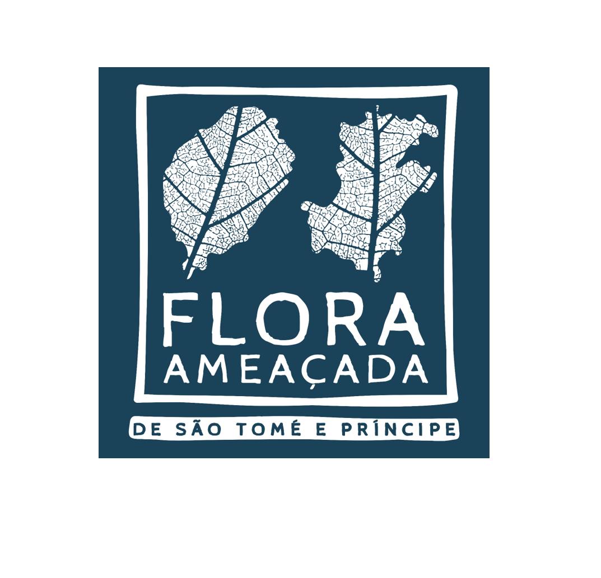

--- 
title: "Red List data book of the plant species endemic to Sao Tomé and Principe"
author:
  - Tariq Stévart
  - Davy U. Ikabanga
  - Anne-Hélène Paradis
  - Gilles Dauby
date: "`r Sys.Date()`"
site: bookdown::bookdown_site
documentclass: book
bibliography: [book.bib, packages.bib]
url: https://github.com/gdauby/saothreath_book
cover-image: forest.jpg
description: |
  Red List data book of the plant species endemic to Sao Tomé and Principe
biblio-style: apalike
csl: chicago-fullnote-bibliography.csl
rmd_files:
   html:
   - index.Rmd
   - 01-chapter1.Rmd
   - 02-mat_meth.Rmd
   - 03-checklist.Rmd
   - 04-conservation.Rmd
   - 05-acknoledgments.Rmd
   - 07-references.Rmd
---


```{r include=FALSE}
# automatically create a bib database for R packages
knitr::write_bib(c(.packages(), 'bookdown', 'knitr', 'rmarkdown'),
                 'packages.bib')
```


# Editors and contributors {.unnumbered}



_Editors_

Tariq Stévart ^[(1) Missouri Botanical Garden, Africa and Madagascar Department, 4344 Shaw Blvd., St. Louis, Missouri 63110-2291, USA, (2) Herbarium et Bibliothèque de Botanique africaine & Université Libre de Bruxelles, campus de la Plaine, boulevard du Triomphe, CP 265, B-1050, Brussels, Belgium (3) Meise Botanic Garden, Domein van Bouchout, Nieuwelaan 38, B-1860 Meise, Belgium, tariq.stevart@mobot.org]
Davy U. Ikabanga ^[(1) Missouri Botanical Garden, Africa and Madagascar Department, 4344 Shaw Blvd., St. Louis, Missouri 63110-2291, USA (2) Laboratoire de Biodiversité, Ecologie et Physiologie Végétale, Département de Biologie, Faculté des Sciences, Université des Sciences et Techniques de Masuku, B.P. 943, Franceville, Gabon]
Anne-Hélène Paradis ^[Missouri Botanical Garden, Africa and Madagascar Department, 4344 Shaw Blvd., St. Louis, Missouri 63110-2291, USA]
Gilles Dauby ^[(1) AMAP,Univ Montpellier, CIRAD, CNRS, INRAE, IRD, Montpellier, France Plant Systematics and Ecology Laboratory, Higher Teachers’ Training College, University of Yaoundé I, P.O. Box 047, Yaoundé, Cameroon, gilles.dauby@ird.fr]


_Contributors_

Patricia Barberá
Laura Benitez ^[laurabenitezbosco@gmail.com]
Christopher J. Bie Mba
L’hée C. M. Bikoukou
António Camuenha
Lewis Eduardo
Davide do Espírito Santos Ceita Dias ^[davide.dias@fundacaoprincipe.org]
Olivier Lachenaud
Angela Lima
Maria do Céu Madureira
Dilson Madre Deus
Diosdado Nguema
Faustino de Oliveira
Murielle Simo-Droissart
Pascoal Sousa
Osvaldo Sousa dos Santos Lima ^[osvaldo.lima@fundacaoprincipe.org]
Estevão Soares
Jeremias Viana dos Prazeres do Carvalho ^[jeremias.carvalho@fundacaoprincipe.org] 


# Background {.unnumbered}

According to the most recent synthesis of knowledge on the flora of São Tomé & Príncipe (STP), around 930 plant species were recorded from these islands, among which a bit more than 800 were native and a hundred are strict endemics to the archipelago.
Unfortunately, native plant populations and vegetation of STP have been strongly impacted since the discovery of the islands and is nowadays increasingly threatened by human pressures linked to the development of agro-industrial plantations, demand for timbers and touristic activities.
Implementing effective conservation activities for protecting the native flora and vegetation in STP was difficult because of a lack of unified database documenting species distribution and unknown and/or outdated evaluation of species extinction risk following categories and criteria of the International Union for Conservation of Nature (IUCN). 
Key Biodiversity Areas (KBAs) are the most important places in the world for species and their habitats. The KBA Programme supports the identification, mapping, monitoring and conservation of KBAs to help safeguard the most critical sites for nature on our planet. KBAs can support strategic decisions on protected areas by governments or civil society towards achieving Aichi Biodiversity Targets. The network of Key Biodiversity Areas of STP include 7 terrestrial areas and cover 512 km² (i.e. around 50% of STP) but its delimitation did not take into account plant biodiversity and vegetation distribution. 
Limited resources hampered the characterization and dynamics of plant diversity in STP. Two herbaria exist, one on each island, but remain underused because of lacking logistics, appropriated materials, and trained botanists/field technicians with skills in specimen collection.
Based on this ascertainment, a multipartners project has been funded by the CEPF, that’s aims to identify threatened plant species using categories and criteria of IUCN, characterize their distribution, habitat and threats they are facing, based on these data, reassess the network of Key Biodiversity Areas of STP and train local botanists and technicians and equip the two herbarias (ST and P). 
This Red List book aims to provide an overview of the endemic species that were assessed during this CEPF project. 


